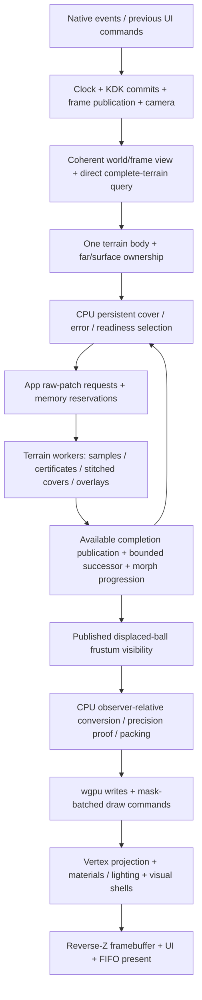
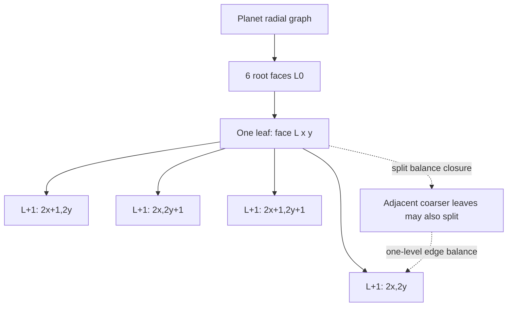
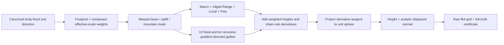
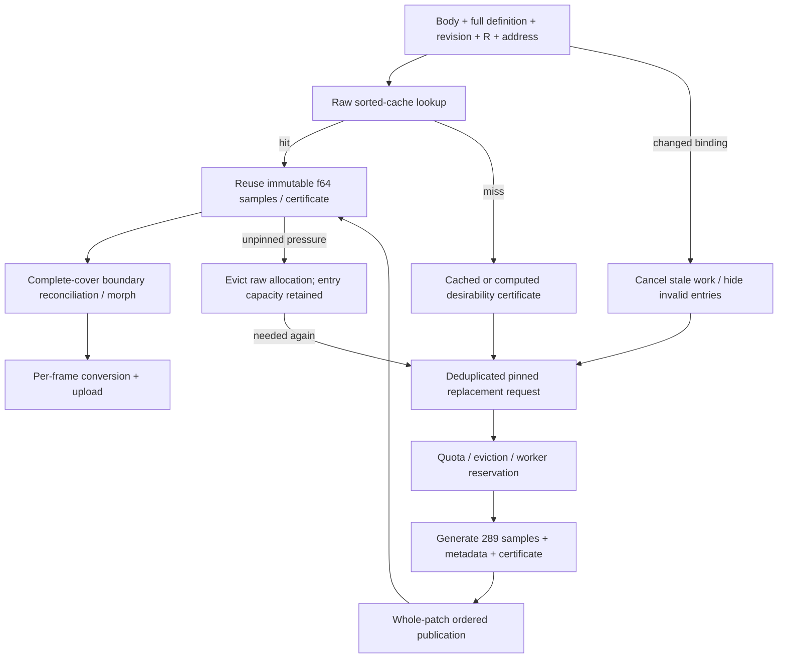
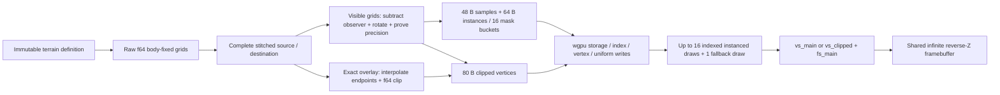

# Engine mechanics reference — implementation at this checkout

This is a code-reading reference, not a design proposal or a completion claim.
It describes the current working-tree implementation, particularly the default
Solar System application and its observer-local terrain path. Historical validation
routes and benchmarks are identified separately. Line ranges refer to the source
snapshot below; symbol names are the more durable navigation anchors.

**Reading rule:** world terrain definitions are authoritative; raw grids, stitched
grids, LOD covers, transitions, camera-relative payloads and GPU resources are
different disposable representations. “Ready,” “rendered,” “desired,” “visible,”
“settled,” and “quality-pending” are not interchangeable.

### Phase 5.11D measurement continuation

The [Phase 5.11D checkpoint](PHASE_5_11D_TERRAIN_PIPELINE_REPORT.md) extends
production-path CPU/worker/GPU measurement; it does **not** implement the requested
pipeline rebalance. Acceptance A still fails. The 128 MiB CPU cap, error thresholds,
raw generation, exact stitched/common-refinement endpoints, CPU morph interpolation,
full payload uploads and captured 150 ms display chain are unchanged. There is
still no keyed persistent GPU terrain geometry cache or zero-copy stitched storage.

Regular preparation now batches each patch's conversion, generated classification
and boundary narrowing into separate timed loops, without vertex-loop clocks or
changes to f64 equations/packed formats. Proof lookup/calculation and actual owned
vector-growth intervals are distinct. Smooth diagnostic octahedral coordinates
remain in conversion. Transition sample timing still combines interpolation,
conversion and classification; clipping/packing are separate. Native debug logs
include population/adaptive/selector/worker/preparation/upload reports.

`surface-profile` also enables a safe optional thread-clock dependency. Scheduled
CPU time is separate from elapsed stage time; Windows measurements here have
15.625 ms granularity and cannot attribute the old 114 ms event. Worker records
distinguish submit-to-start, finish-to-cache-reception and coordinator consumption
waits; old retained last-completion timers are not summed as per-frame work.

Renderer/capture device creation requests timestamp features only when supported.
Actual query scopes measure main/atmosphere/overlay passes and, with inside-pass
support, regular terrain, combined transition/fallback, ocean, clouds and remaining
celestial spheres. Per-frame written-scope masks reject stale absent values. Native
readback has one bounded slot and skips busy sampling rather than waiting; its
latest completed GPU result may belong to an earlier frame. Capture uses its
readback opportunity. `None` means absent/unavailable/uncompleted, never inferred
zero GPU cost. CPU encode/upload/wait/readback timings remain separately labelled.
The retained RX 9070 XT/Vulkan capture **does support** these timestamp scopes;
older "GPU timestamps unavailable" statements describe older instrumentation, not
that adapter's capability. GPU buffer capacities remain persistent but geometry
contents are rewritten; timestamp resources do not introduce terrain residency.

Six new release descents did not reproduce >100 ms, and still reached exactly
128 MiB. The final rebuilt pair peaks at 25.668/35.163 ms update+prepare; final cold
source remains L5/L8/L18 at 1/2/5 seconds versus desired L23. Quality gates pass,
but Acceptance A does not. No fixed-outlier or recovered-headroom claim follows.
Current measurement
evidence is `docs/evidence/phase511d/final/`, with final commands/fingerprints and
validation under `docs/evidence/phase511d/`; earlier reports/evidence remain historical
and preserved. CPU/GPU ownership, precision representation and refinement semantics
in the remaining sections are unchanged; their line ranges predate the new timers.

## 0. Repository state and scope

Recorded before creating this document, on 2026-10-04:

| Item | Observed state |
| --- | --- |
| Branch | `main` |
| HEAD | `5d1fe77ced96229b3393c17e83965680ee6d0fbf` — `Record Phase 5.10B evidence and failed Acceptance A gate` |
| Working tree clean? | **No.** Existing changes are listed below and were preserved. |
| Workspace | `Cargo.toml:1–34`: six crates, resolver 3, Rust edition 2024, unsafe code forbidden; committed `Cargo.lock`. |
| Toolchain | `rust-toolchain.toml:1–4`: moving `stable`, minimal profile with rustfmt/Clippy. Locally observed Rust/Cargo 1.98.1. No custom workspace build profiles are declared. |
| Main executable | `mundaris_app`, `crates/app/src/main.rs`; app also has a headless library target. |
| Default route | No argument or `--solar-system` → gameplay Solar System. `--real-solar-system`, `--gravity-orbits`, `--celestial-model`, `--reference-frames` are alternative routes (`main.rs:231–265`). |
| Primary renderer | `wgpu` 27 native presentation, WGSL shaders, celestial infinite reverse-Z pass, egui 0.33 / winit 0.30. CPU-selected terrain; not compute/GPU-driven LOD. |
| Actual backend | **Not established by this analysis.** `Renderer::new_async` uses the default wgpu instance and a high-performance compatible adapter, then logs its backend (`crates/renderer/src/lib.rs:80–99,143–147`). The app does not force Vulkan/DX12. Retained offscreen evidence names an RX 9070 XT; that is not proof of this session's live adapter/backend. |
| Optional features | `surface-profile`: CPU timing instrumentation; `terrain-capture`: offscreen production-path GPU readback (`crates/app/Cargo.toml:7–9`, `crates/renderer/Cargo.toml:7–10`). Neither is a different terrain algorithm. |
| Test/benchmark executables | Cargo integration-test targets under math/world/renderer/app/simulation; Criterion targets and app probe/capture examples, catalogued in §19. No new runtime test or benchmark was run for this documentation task. |

Initial `git status --short`:

```text
 M .gitignore
 M MUNDARIS_ENGINE_DESIGN.md
 M docs/architecture.md
 M docs/roadmap.md
?? .opencode/
?? AGENTS.md
?? MUNDARIS_PHASE_5_PROCEDURAL_TERRAIN_GENERATION.md
?? docs/opencode-workflow.md
?? scripts/
```

### Important documentation disagreements

- `docs/architecture.md:118–119,195–214` still describes procedural terrain as
  deferred / a “not implemented” boundary. `crates/world/src/terrain/`,
  `crates/app/src/planet_terrain/` and renderer displaced surfaces **are implemented**.
- `docs/engine-invariants.md:38–46` contains an older milestone summary saying
  terrain/LOD are deferred; that is not the current implementation inventory.
- `docs/adr/0006-planet-surface-topology-and-lod.md:29–35` accurately describes
  Phase 4's historical no-worker, radial-normal, sample32/clipped64 path. Current
  terrain uses workers, analytic displaced normals, sample48/clipped80 and morphs.
- `docs/phase-5-7-adaptive-terrain.md:120–148` describes the older synchronous
  generation checkpoint. The native default now has four workers and exact-input
  reuse, with the qualifications in §§8,16–17.
- The latest retained performance/acceptance evidence is Phase 5.10B, not earlier
  `final-*`/`audit-*` datasets. Its responsiveness Acceptance A **fails**; appearance
  is not accepted (`docs/evidence/phase510b/README.md:9–29`,
  `docs/phase-5-10b-acceptance-a.md:312–328`).
- The current planetary presentation/refinement continuation is tracked in
  [`docs/PHASE_5_PLANETARY_PRESENTATION_REPORT.md`](PHASE_5_PLANETARY_PRESENTATION_REPORT.md);
  its current measured continuation does not upgrade the failed Acceptance A result.
  Sections on successor progression and planetary layers reflect that continuation;
  unchanged line ranges still refer to the original reading snapshot. Current GPU
  captures establish RX 9070 XT/Vulkan for the offscreen run, not native presentation
  latency. Current evidence is `docs/evidence/phase5-overnight-planetary/after/current-*`.

## 1. High-level frame architecture

### A complete drawable default-app frame

All stages below execute on the app/event-loop CPU thread unless marked worker or
GPU. A frozen simulation does not freeze terrain preparation or presentation.

1. **Native input and redraw opportunity.** `MundarisApp` routes window input into
   egui and invokes `GravityOrbitsDemo::render` on redraw (`crates/app/src/main.rs:
   124–180`). `RedrawSchedule::update` maintains a 16 ms deadline, skips catch-up
   redraws, and sleeps when not drawable (`crates/app/src/redraw.rs:7–28`).
   Input collected by this frame's UI becomes queued `Command` / `NavigationInput`
   for a subsequent update, not a mutation of already-prepared geometry.
2. **Clock classification, commands, simulation, frames, camera.**
   `GravityOrbitsDemo::render` determines elapsed drawable time and calls `update`
   (`crates/app/src/gravity_orbits.rs:1187–1207`). `update` drains queued commands,
   rejects hidden/long-gap progression, admits time, pumps exact fixed-step KDK
   in one initial unit then ≤32-unit chunks / ≤512 total with a 4 ms opportunity
   budget, publishes celestial frames, updates guides/metrics, then navigation
   (`gravity_orbits.rs:795–1017`). World states change only on commits/commands;
   camera is app-owned. Physics and frame publication are not terrain generation.
3. **Coherent read and body requests.** `CelestialFrameProjection::coherent_view`
   checks world namespace, body count, revision and exact time. `prepare_visuals`
   prepares derived trails/guides; render builds one `CelestialRenderBody` per
   body with fixed frame, physical reference radius, display color and flags.
   Requests/owners are app vectors rebuilt with retained capacities
   (`gravity_orbits.rs:1213–1283`, `crates/world/src/frame_projection.rs:79–159`).
4. **Direct terrain-under-camera query and projection.** For a focused rocky body,
   `terrain_inspection::terrain_clearance` recompiles a `TerrainGenerator` and
   synchronously evaluates **complete, unfiltered** terrain at the camera's radial
   direction. This is not a raw-grid cache lookup. Near plane is initially based
   on the minimum relevant reference/terrain clearance, `max(0.1 m,0.01×clearance)`
   for positive finite clearance (`gravity_orbits.rs:223–229,1245–1288`,
   `crates/app/src/terrain_inspection.rs:23–74`).
5. **Body admission / representation handoff.** `TerrainPopulation::update` computes
   far-representation error and chooses the one relevant terrain body with greatest
   projected far error. Inactive terrain bodies keep far representations and
   unpinned raw cache data; their jobs are cancelled on switching. App-owned
   `PlanetSurfaceSession` tracks `Far → Prewarm → Surface`; complete ready terrain
   is also required before its owner bit suppresses the far sphere
   (`crates/app/src/terrain_population.rs:79–179`, §4.1).
6. **LOD evaluation and raw work.** `AdaptiveTerrainCover::update_with_elapsed`
   validates immutable identity, advances/completes a morph, pins sources, checks
   obsolete work, and runs `SurfaceLodSession::update_with_policy`. It requests a
   complete sibling/balance closure, not arbitrary independent child publication.
   `TerrainPatchCache::generate` publishes finished worker results and schedules
   admitted jobs. Main-thread inputs include view, certificates and readiness;
   worker inputs contain only immutable terrain binding / addresses / geometry
   (`crates/app/src/planet_terrain/adaptive.rs:287–577`, §4).
7. **Ready stitched destination and optional morph.** When all target raw grids are
   resident and memory is admitted, the app submits a complete-cover stitch/morph
   job. Workers reconcile boundary ownership and build exact old/new triangle
   overlays. Later app-thread publication installs a complete surface or begins
   its morph; old coverage is retained until then (`adaptive.rs:578–859`,
   `crates/app/src/planet_terrain/workers.rs:392–443`). This work runs on changes,
   not for every unchanged frame.
8. **Published visibility and optional camera correction.** The published cover
   is re-frustum-tested against displaced bounds. A ready-mesh radial probe measures
   actual stitched/morph triangles. The optional debug guard pushes the camera
   outside both complete terrain and drawn mesh; render then recomputes view/near
   and re-culls without another generation/selection pass
   (`adaptive.rs:1043–1076`, `gravity_orbits.rs:1307–1359`, §14).
9. **Lighting and CPU payload preparation.** Render computes central-star direction
   in the admitted body's fixed axes and content readability thresholds; constructs
   `CelestialFrame`; appends visible stitched grids plus active transition triangles;
   appends far bodies/observations and optional lines (`gravity_orbits.rs:1360–1459`).
   `SurfaceStaging::append_inner` source-centres f64 positions, narrows/proves
   precision, calculates transient classifications, packs fresh bytes and groups
   instances by stitch mask. Transition append CPU-interpolates and clips each
   overlay triangle. These stages repeat every frame (§§10,16).
10. **Native surface/UI and upload.** `Renderer::render_celestial` validates the frame.
    `render_frame` acquires a swapchain texture, runs the egui callback/tessellation,
    lazily creates GPU renderer resources, and invokes `CelestialRenderer::draw`
    (`crates/renderer/src/lib.rs:205–298`). The CPU terrain frame already exists
    when UI is evaluated. GPU sample/instance/fallback and lighting/projection
    buffers are written every frame; capacity growth can explicitly wait for GPU
    progress (`crates/renderer/src/planet_surface/gpu.rs:121–213`).
11. **GPU rasterization and final framebuffer.** Celestial pass clears color and
    reverse depth to 0, draws far spheres, surface mask batches, fallback/morph
    triangles, optional Natural ocean/cloud shells, history and polylines. A separate
    atmosphere pass samples completed celestial depth before no-depth overlays/UI.
    WGSL projects positions and shades interpolated normals/classifications. egui
    is overlaid in a no-depth pass; command buffers
    are submitted, `pre_present_notify` is called, then the texture is presented
    (`crates/renderer/src/celestial.rs`, `lib.rs:300–339`).



### Ownership and repeat conditions

| Result | Owner / lifetime | Recomputed when |
| --- | --- | --- |
| Physical bodies, terrain definition/revision | `CelestialSystem`; authoritative | Successful world mutations / physical ticks |
| Body frame projection | World-owned disposable `CelestialFrameProjection` | Publication/rebuild; coherent immutable borrow during preparation |
| Camera pose / inspection anchor | App `CelestialCamera` | Navigation, focus, attachment, guard, scripted approach |
| LOD cover, hysteresis, pending dependencies | Renderer-owned session held by app coordinator | Evaluated each active update, topology changes only on admitted readiness |
| Raw f64 patch samples/certificate | App aggregate `TerrainPatchCache`, `Arc<GeneratedSurfacePatch>` | Miss, eviction/re-request, identity change; not camera/light motion |
| Stitched complete cover and exact morph endpoints | App `AdaptiveTerrainCover`, CPU worker outputs | Replacement/constraint changes; immutable during display |
| Visible leaves / reports | App + renderer session scratch | Every update / post-guard re-cull |
| Observer-relative bytes | Renderer `SurfaceStaging` | Every frame, even unchanged |
| GPU capacities/topology | `PlanetSurfaceRenderer` | Initial creation / growth; contents overwritten each frame |

## 2. Planet representation and coordinates

`BodyProperties` contains f64 `mass_kg` and `reference_radius_m`; `BodyState` contains
checked f64 centre/velocity, body-to-system quaternion, and system-axis angular
velocity (`crates/world/src/body.rs:25–101`). A body can attach an immutable
`TerrainDefinition` and independent terrain revision (`body.rs:104–117`). There is
no authoritative patch tree or global generated planet mesh in world.

`CelestialFrameProjection` creates two nodes per body: a translating child of the
system root at its centre, then a body-fixed rotating child with zero local
translation (`crates/world/src/frame_projection.rs:36–55,113–159`). Moon orbit
metadata does not make the Moon inherit Earth spin. Body-local origin is the body
centre; system coordinates are metre-valued f64. Local +Y is the authored spin/
latitude axis in Solar System content; orbit initialization uses system XY
(`crates/app/src/solar_system.rs:340–365`). This is not a height-function latitude mask.

For cube face basis `(N,U,V)` and chart coordinates `u,v ∈ [-1,1]`:

\[
q=N+uU+vV,\qquad n=q/\|q\|.
\]

`CubeFace::basis/direction` implements exactly this normalized radial cube mapping
(`crates/math/src/surface.rs:8–45`); it is not an equiangular or spherified cube.

| Face enum / ID | N | U | V |
| --- | --- | --- | --- |
| `PositiveX` / 0 | +X | −Z | +Y |
| `NegativeX` / 1 | −X | +Z | +Y |
| `PositiveY` / 2 | +Y | +X | −Z |
| `NegativeY` / 3 | −Y | +X | +Z |
| `PositiveZ` / 4 | +Z | +X | +Y |
| `NegativeZ` / 5 | −Z | −X | +Y |

Surface is a radial height graph, with footprint-filtered height `h(n,ρ)`:

\[
p_{body}=n\,[R+h(n,\rho)],\qquad
p_{system}=c_{system}+Q_{body\to system}p_{body}.
\]

Actual sample construction is `direction * (radius + sample.height_m())`
(`crates/app/src/planet_terrain.rs:953–966`, worker equivalent
`crates/app/src/planet_terrain/workers.rs:361–374`). It supports negative elevation,
but not caves, overhangs, sparse edits or volumetric terrain. A reference sea datum
does **not** change geometry.

With accumulated Cartesian direction derivative `g`, generator returns tangent
gradient `gT = g − n(n·g)`. Analytic displaced-surface normal is:

\[
N_{terrain}=\operatorname{normalize}\left(n-\frac{g_T}{R+h}\right).
\]

`TerrainSample::normal_body` uses this formula, not just `n`
(`crates/world/src/terrain/generator.rs:668–672`,
`crates/world/src/terrain/query.rs:49–82`). §13 explains seam/morph qualifications.

The renderer cancels common ancestry and subtracts the observer **in the source
frame before camera rotation and f32 conversion**. Effectively:
`p_view = camera_from_source * (p_body − observer_in_body)`
(`crates/renderer/src/view.rs:126–193`, `crates/math/src/frames.rs:403–418,525–537`).
Generated normals and sunlight stay in body-fixed axes; positions use camera axes.

### Scale and Earth-specific authoring

- Default gameplay Earth has **R = 400,000 m**, not 6,371,000 m. All catalogue radii
  and initial orbital distances share factor `400000/6371000`; masses are recomputed
  as `g_reference R²/G` (`crates/app/src/solar_system.rs:225–264`). Real-scale route
  uses catalogue mean radii and orbital lengths, not an ephemeris.
- Ten bodies are authored; Mercury/Venus/Earth/Moon/Mars have rocky V2 definitions;
  Sun/gas giants remain far spheres. Definition radii are validated ≤100,000,000 m,
  envelope ≤0.1R, and positive residual radius (`crates/world/src/terrain/mod.rs:
  332–348`). Generic positive `BodyProperties` itself has no such upper cap.
- Earth seed/identity is `0x45415254`; only Earth enables the checkpoint elevation
  diagnostic in content (`solar_system.rs:87–100,185–216`). Its display sea datum is
  hardcoded 350 m (`solar_system.rs:398–410`). Generic geometry/math is not Earth-only.
- Angular frequencies remain dimensionless under changing R; metre scales compile
  to frequency `R/λ`. Height scaling differs between Solar System content and the
  older checkpoint preset (§6), so “scale the body” has no single terrain outcome.

## 3. Terrain patch/tile system

### Address, region and hierarchy

`CubePatchAddress { face: CubeFace, level: u8, x: u32, y: u32 }` is a compact
computed region, not a heap tree node (`crates/math/src/surface.rs:88–176`).
Valid `0≤L≤30`, `0≤x,y<2^L`. Six roots are `(face,0,0,0)`.
Parent is `(L−1,floor(x/2),floor(y/2))`; children have coordinates
`(2x+dx,2y+dy)`, ordered `dx+2dy`. Sorting is face then computed Morton traversal
prefix then level; it is not an agreed persistence encoding.

For patch-local `s,t∈[0,1]`:

\[
u=-1+\frac{2(x+s)}{2^L},\qquad
v=-1+\frac{2(y+t)}{2^L}.
\]

`face_uv`, `patch_local`, `contains`, `neighbor` provide region / exact cross-face
adjacency (`surface.rs:172–249`). Example: `(PositiveZ,L2,x1,y2)` covers
`u∈[-0.5,0]`, `v∈[0,0.5]`; centre direction is normalized `(-0.25,0.25,1)`.
Its parent is `(PositiveZ,L1,x0,y1)`; child coordinates are `(2,4),(3,4),(2,5),(3,5)`.
This region remains valid independently of camera, world origin, cache residency
or GPU offset.



The implemented hierarchy is represented by sorted contiguous leaf/ancestor
sets (`AddressSet`, `crates/renderer/src/planet_surface/cover.rs:1–65`), with
computed parents/children. No entire maximum-depth tree is allocated.

### Grid, indices and seams

- `GRID_CELLS=16`, `GRID_SAMPLES=289`: 17×17 vertices for 16×16 cells
  (`crates/renderer/src/planet_surface/topology.rs:1–43`). Vertex index is `j*17+i`.
  Mask 0 emits triangles `[a,b,d]` and `[a,d,c]`, 512 triangles / 1,536 u16 indices.
- Sixteen shared index variants collapse odd edge vertices when that edge borders
  a one-level-coarser leaf. Mask bits UMin/UMax/VMin/VMax are 1/2/4/8; degenerate
  triangles are omitted. Unreferenced odd vertices are still sampled/packed.
  No skirts or per-patch GPU index allocations exist.
- `sample_key(i,j,16)` constructs an exact reduced dyadic cube tuple before f64
  normalization. Shared siblings / face seams / cube corners get identical keys
  and arithmetic order (`crates/math/src/surface.rs:250–314`). This is coordinate
  identity, **not** a global terrain-sample cache.
- `StitchedSurface::build_reusing` validates a complete sorted cover, no ancestor
  overlap, complete per-face area and one-level edge balance. Coarsest incident
  leaf (then address tie-break) owns shared samples. Its displaced position and
  normal are copied to other incident grids; profile corrections taper into the
  first two interior rows (`crates/renderer/src/planet_surface/stitching.rs:70–222,
  295–345`). Invisible incident leaves participate before visible selection.
- Morphs use exact old/new triangle common-refinement overlays, not interpolation
  between unrelated vertex arrays. CPU geometric/precision clipping is separate
  from stitch seam handling (§10).

### Memory representations and lifecycle

| Representation | Actual data |
| --- | --- |
| Logical candidate/leaf | `CubePatchAddress`, `PatchMetadata`, error/cull result |
| Active record | `ActiveSurfacePatch { address, stitch_mask, metadata, error_pixels }` (`lod.rs:167–173`) |
| Raw CPU patch | `GeneratedSurfacePatch`: address, f64 R/footprint, boxed 289 `SurfaceGeometrySample`, extent/error certificate (`terrain_geometry.rs:8–23`) |
| CPU sample | Two `DVec3`: body position and unit analytic normal; 48 bytes, hence 13,872 sample bytes/patch, excluding headers |
| Stitched cover | Full vector of constrained `GeneratedSurfacePatch` grids plus masks; separate from immutable raw cache |
| Morph payload | Triangle vector of `TransitionVertex`: old/new body samples, triangle addresses/indices/barycentrics and elevation endpoints (`transition.rs:209–262`) |
| Regular GPU sample | 48 bytes: position vec4, normal vec4 (w=elevation diagnostic), classification vec4 |
| Regular GPU instance | 64 bytes: sample base, LOD, face, flags, RGBA, reserved padding |
| Clipped/morph GPU vertex | 80 bytes: clip vec4, normal/elevation vec4, RGBA vec4, UV/flags vec4, classification vec4 |

Lifecycle in the production route:

1. Current visible/error evaluation requests a candidate **closure**.
2. Metadata / app terrain certificate can evaluate desirability before raw grid exists.
3. Missing raw patch gets a bounded app request/reservation; workers generate its
   entire grid, certificate and validated patch. Serial path resumes partial grids.
4. Complete closure readiness permits private selector replacement. Complete target
   cover then becomes an off-thread stitch/morph construction input.
5. App publishes complete destination or synchronized morph. During morph, unaffected
   source leaves draw regularly; affected source leaves are replaced by overlay.
6. Published visible grids are converted, uploaded and rendered every frame.
7. Raw grids persist while pinned or until LRU pressure/invalidation. Stitched
   destinations become sources at morph completion; old overlays/destinations drop.
8. On merge, body switch or revision change, obsolete requests/jobs are cancelled;
   unpinned raw entries can remain reusable, while worker-held allocations stay charged.

Sources: `crates/app/src/planet_terrain/adaptive.rs:297–345,389–445,475–880`,
`crates/app/src/planet_terrain.rs:650–878,882–1119`.

## 4. LOD system — exact decisions and scheduling

### 4.1 Entry points, body admission and limits

Default app call chain:
`GravityOrbitsDemo::render → TerrainPopulation::update →
AdaptiveTerrainCover::update_with_elapsed → SurfaceLodSession::update_with_policy →
update_inner`. Renderer sees certificates/readiness, not procedural seed or world.

Far demand includes smooth-sphere error `0.005R` plus terrain's absolute envelope.
`PlanetSurfaceSession::terrain_required` first rejects the expanded whole-body ball
outside frustum, then requires far error ≥0.05 px. Population chooses greatest far
error, **not simply selected UI BodyId**. Handoff enters Prewarm, then Surface when
surface error ≤0.125 px or rapid approach has far error >0.125 px; actual owner
still requires `cover.ready()`. Returning / switching waits for a successfully
prepared far representation; no simultaneous opaque sphere/surface draw
(`crates/app/src/planet_surface.rs:98–217`,
`crates/app/src/terrain_population.rs:79–169`).

| Limit | Renderer default | Production population setting / significance |
| --- | --- | --- |
| Split | strictly `>0.125` physical pixels | Same |
| Merge | visible parent strictly `<0.0625` pixels | Same; invisible eligible siblings may merge regardless of error |
| Minimum / initial LOD | 0 / six roots | Same |
| Maximum LOD | 30 | 30; representational ceiling, not proven useful-quality convergence |
| New metadata/update | 32 | Existing allowance divided across all registered sessions (`32 / max(sessions.len(),1)`); redistribution to active selectors was measured experimentally and not retained |
| Visible leaves | 4,096 | 2,048 |
| Logical covering leaves | 65,536 | Terrain 2,048; non-terrain smooth route 32,768 |
| Metadata cache | chosen per session, 6–4,096 | Adaptive selector creates a 4,096-record cache |
| Raw patch entries | app-owned | ≤4,096 total, aggregate across bodies |
| Pending raw work | app-owned | ≤256 |
| Adaptive replacements/update | policy-specific | **At most one** complete merge/split transaction |
| CPU memory | separate renderer/app caps | App aggregate 128 MiB; includes reservations, §16 |

Sources: `crates/renderer/src/planet_surface/lod.rs:43–103,196–230`,
`crates/app/src/terrain_population.rs:119–121,171`,
`crates/app/src/planet_terrain/adaptive.rs:115–134,332`,
`crates/app/src/planet_terrain.rs:19–24`.

The independent `TerrainReadyCover` legacy preview uses a **uniform whole-planet
target capped at L4** (`planet_terrain.rs:174–294`). Some benchmarks still use it.
That is not the default adaptive production LOD and does not impose an L4 cap on it.

### 4.2 What persists, and what is traversed every update

`SurfaceLodSession` owns `cover`, `previous_splits`, `pending/pending_parent`,
metadata cache, proposal/pin/coarse/merge/desired sets, stack and visible buffers
(`lod.rs:174–230`). Initial cover is six ready-metadata roots. The **active cover
persists**; it is not regenerated from a maximum-depth tree every frame.

Each `update_inner`:

1. Prepares body source and repins cover plus ancestor chain; clears obsolete pending
   closure when its parent is no longer visible / above split threshold.
2. Builds unique parent merge candidates from existing leaves, considers deepest
   first, requires all four immediate children and valid external neighbor levels.
3. Scans every covering leaf for visible above-threshold split requests; sorts priorities.
4. Proposes sibling/balance transactions, subject to policy freeze/readiness/admission.
5. Rebuilds visible leaves and masks from the current complete cover.
6. **Separately traverses desired coverage from six roots**, using hysteresis history
   and only available child metadata. Missing subdomains mark an incomplete estimate;
   desirability traversal does not recursively generate all missing raw grids.
7. Computes report/max error/settled and scans cover relevance again for cull counts.

Source: `lod.rs:329–747`. The app additionally re-culls its published stitched
source cover and calculates radial convergence diagnostics (§18), since selector
target and rendered source can differ.

Thus offscreen covering leaves still incur metadata, parent/pin/merge and relevance
bookkeeping. Root traversal stops refinement on irrelevant patches, but does not
make the entire unchanged-frame CPU cost zero. No camera-change-only selection
throttle exists in this path.

### 4.3 Error certificates and projection equation

`PatchMetadata::build` evaluates 289 **unit-sphere directions** and the union of
all stitch triangles to establish cap `(axis,α)`, geometric normal envelope,
minimum plane offset and dimensionless sphere error (`bounds.rs:99–163`).
Its analytic fallback uses `δ=0.5/2^L`,
`e_unit = min(max(1−c_min,64ε), 2 sin²(δ/2)+64ε)`.
This metadata calculation is not 289 procedural terrain queries.

Terrain policy supplies nonnegative metre contributions:

\[
E=E_{sphere}+E_{filtered\ interpolation}+E_{unresolved}
 +E_{boundary}+E_{morph}+E_{numeric}.
\]

`SurfaceErrorContributions::total_m` sums with outward rounding
(`crates/renderer/src/planet_surface/bounds.rs:9–74`). For affine face-domain
triangle diameter `D=√5·2/(16·2^L)`, app certificate uses:

\[
\begin{aligned}
E_{sphere}&=\max(R e_{unit},\ 3R D^2/6),\\
E_{interpolation}&=\min(2A+A\min(D,2),\ (G+A)D,\ (H+5G+3A)D^2/6),\\
E_{unresolved}&=\text{sum of omitted/faded octave amplitude bounds},\\
E_{numeric}&\simeq512\epsilon\,[R+\max(|h_{min}|,|h_{max}|)].
\end{aligned}
\]

Here A/G/H are represented-height / Cartesian derivative / Hessian envelopes,
not actual sampled maxima. Formula operations round outward. Unresolved terrain
counts against full truth even when filtered out of the mesh. `terrain_surface_certificate`
optionally narrows global height interval using centre filtered height ± `Gα`,
expanded by unresolved/numeric bounds; generated grids reuse their already sampled
centre for that anchor (`crates/app/src/planet_terrain/certificate.rs:12–103`).
`TerrainGenerator::bounds_for_region` itself currently ignores `_cap` and provides
global fallback bounds (`crates/world/src/terrain/generator.rs:773–843`).

Policy also adds a per-level profile-difference allowance against level `max(L−2,0)`
for coarsest incident boundary ownership, and active morph's maximum remaining
displacement. Extents are expanded by these allowances
(`crates/app/src/planet_terrain/adaptive.rs:97–113,323–330,454–473`).

Bounds ball is centred on interval midpoint, not automatically padded by absolute
height uncertainty. For midpoint `m`, half-width `w`:
`c_body = axis·(R+m)cosα`, `b ≈ (R+m)sinα+w+numeric margin`
(`bounds.rs:175–214`). Transform centre to camera coordinates.

With viewport W×H, vertical FOV θ, focal pixels `f=H/[2tan(θ/2)]`:

\[
z_0=\max(-c_{view,z}-b,near),\quad
E_{px}=\begin{cases}
\infty,&E\ge z_0/2,\\
f\frac{E}{z_0-E}\sqrt{1+(t_x+E/(z_0-E))^2+(t_y+E/(z_0-E))^2},&\text{otherwise},
\end{cases}
\]

where `ty=tan(θ/2)`, `tx=ty·W/H` (`bounds.rs:259–275`). This is a conservative
bound, **not** a per-patch fixed distance threshold or measured visual error.
Near intersections / broad bounds can make error infinite. There is no explicit
altitude→LOD lookup; altitude influences transformed depth/bounds and camera policy.

### 4.4 Split, merge and prioritization

**Split:** patch is relevant/visible, `error>split`, and `L<max_level`.
Priority comparator first prefers the leaf containing the camera's **radial
direction from the body centre**, then descending projected error. If both errors
are infinite, larger apparent extent, smaller view offset, shorter distance and
address resolve ties. Finite-error ties use address. A previously admitted pending
closure stays first unless a new camera-local chain outranks it
(`lod.rs:428–473,907–947`).

**Screen centre is not the primary priority.** The camera-radial patch can be at the
bottom/offscreen in tangent views; it still must pass conservative visibility to
be a split request. View offset does enter infinite-error ties, so “screen centre
never matters at all” is also false. Prefetch while constructing/morphing likewise
looks for a visible, over-threshold radial-chain parent (`adaptive.rs:493–543`).

**Merge:** all four children must be covering leaves. Parent's certificate/bounds
are evaluated; a visible parent must have `error<merge`; invisible parents can
coarsen. `merge_neighbors_valid` checks outside edges so one-level balance survives.
App policy also needs parent raw readiness, reservation and permission. The
all-stitch metadata/certificate conservatively covers a hypothetical stitched
parent; the merge path does not build a specific parent-mask mesh to test its
actual visual error (`lod.rs:363–410,823–905`).

**Hysteresis:** split threshold 0.125 versus merge 0.0625; desired traversal uses
lower threshold for `previous_splits` (`lod.rs:649–653`). No time/distance hysteresis
interval is used. Camera motion or pending obsolescence can cancel a queued closure.

**Does the entire visible planet use the same LOD?** No in production. Error/depth/
region differ by leaf; requests progress locally, balancing adds neighboring guard
refinement, and complete cover contains mixed levels. Six roots or some early
states can happen to be uniform. Only the retained legacy `TerrainReadyCover`
deliberately chooses uniform whole-planet levels.

**Which regions refine first near the ground?** Relevant observer-radial leaves
are prioritized, then largest certified projected error; their balancing neighbors
also generate/refine. This is not simply all regions at the same camera-centre
distance, and not a foveated screen-centre quality scheme.

**What prevents global highest-LOD refinement?** Local error/depth, frustum rejection
(plus smooth-only horizon rejection), finite leaf/cache/work/memory limits and
atomic readiness gates. Culled regions retain coarse covering leaves. Displaced
terrain currently has no usable horizon occlusion, so far hemisphere can still cost
more than a horizon-culled terrain design would; it does not imply global L30 meshes.

### 4.5 Consequences of one split / merge

Split call path (`lod.rs:474–595`, `adaptive.rs:475–859`):

1. Compute four child addresses; copy complete cover into proposal and replace parent.
2. Find all edge-balance violations; recursively split required coarser neighbors.
   Each forced split adds three leaves; dependency closure includes all their children.
3. Resource-preflight proposal; request/pin raw dependencies, build missing metadata
   under per-update quota, retain source/ancestors and incomplete siblings.
4. Cache hits reuse raw grids; misses schedule CPU sampling and per-grid certificate
   generation (§6). Children need not be sampled just to **decide desire**, but must
   exist and validate before committing ready replacement.
5. Check proposal visibility and limits; atomically swap private selector cover and
   update split history if all dependencies ready. Otherwise retain current cover.
6. App builds complete target masks, retains raw handles, submits stitch/overlay job.
7. Ordered completion publishes whole destination or starts morph. CPU observer
   conversion/packing/GPU upload then exposes increasing detail as morph progresses.
8. Final morph completion promotes target and releases old derived geometry.

Merge call path reverses the hierarchy, but still requires an immutable raw parent
grid (regenerated if evicted), complete-cover stitching and possible old/new overlay;
there is no guarantee merge is free. Child raw data can remain cached and unpinned.
At most one replacement is committed per adaptive update, including a merge. During
an active morph, one complete successor may be constructed from that morph's
immutable stitched destination and held in a bounded single-successor queue; it
cannot display until the current morph reaches and publishes that endpoint. The
successor is not built from the changing visible fraction, and does not compose a
second simultaneous overlay. Construction/morph/resource constraints otherwise
freeze selector commits (`adaptive.rs:115–134,454–473`). A split transaction can
include several balancing parents but advances any participating leaf by one level.

The 16/24/32 MiB overlay retry allowances are ceilings. Construction may receive a
smaller envelope, bounded by the hard cap minus cache residency, coordinator/source,
full renderer staging, selector scratch and full construction workspace. It never
reduces below the initial 16 MiB allowance in ordinary operation. The exact builder
still rejects excess allocation; publication and reservation transfer use the actual
granted envelope. This avoids freezing a ready private target solely because an
unused part of its retry ceiling cannot be reserved. Probe diagnostics distinguish
the requested ceiling from the last admitted envelope.

### 4.6 Theoretical patch counts (not allocated counts)

Uniform level L would contain `4^L` patches per face and `6·4^L` globally. All
addressable levels are shown because code supports L30; there is **no universal
maximum useful level** below it. Useful/certifiable target is view/terrain dependent.

| Level | Potential patches per cube face | Potential global patches |
| ---: | ---: | ---: |
| 0 | 1 | 6 |
| 1 | 4 | 24 |
| 2 | 16 | 96 |
| 3 | 64 | 384 |
| 4 | 256 | 1,536 |
| 5 | 1,024 | 6,144 |
| 6 | 4,096 | 24,576 |
| 7 | 16,384 | 98,304 |
| 8 | 65,536 | 393,216 |
| 9 | 262,144 | 1,572,864 |
| 10 | 1,048,576 | 6,291,456 |
| 11 | 4,194,304 | 25,165,824 |
| 12 | 16,777,216 | 100,663,296 |
| 13 | 67,108,864 | 402,653,184 |
| 14 | 268,435,456 | 1,610,612,736 |
| 15 | 1,073,741,824 | 6,442,450,944 |
| 16 | 4,294,967,296 | 25,769,803,776 |
| 17 | 17,179,869,184 | 103,079,215,104 |
| 18 | 68,719,476,736 | 412,316,860,416 |
| 19 | 274,877,906,944 | 1,649,267,441,664 |
| 20 | 1,099,511,627,776 | 6,597,069,766,656 |
| 21 | 4,398,046,511,104 | 26,388,279,066,624 |
| 22 | 17,592,186,044,416 | 105,553,116,266,496 |
| 23 | 70,368,744,177,664 | 422,212,465,065,984 |
| 24 | 281,474,976,710,656 | 1,688,849,860,263,936 |
| 25 | 1,125,899,906,842,624 | 6,755,399,441,055,744 |
| 26 | 4,503,599,627,370,496 | 27,021,597,764,222,976 |
| 27 | 18,014,398,509,481,984 | 108,086,391,056,891,904 |
| 28 | 72,057,594,037,927,936 | 432,345,564,227,567,616 |
| 29 | 288,230,376,151,711,744 | 1,729,382,256,910,270,464 |
| 30 | 1,152,921,504,606,846,976 | 6,917,529,027,641,081,856 |

Production's 2,048-leaf cover cannot even hold a globally uniform L5. That is a
different statement from whether it can have a **small local chain** at L23/L30.

### 4.7 Unchanged-frame work: explicit answer

Even with camera/terrain unchanged: active body admission/error, direct complete
terrain clearance query, selector pin/ancestor/merge/request scans, root-based
desired traversal, mask/cull/report work, cache lookups/accounting, published
visibility, radial target diagnostics, worker completion polling, fresh f64→view
conversion, boundary-key sorting, classifications, precision-cache checks, byte
packing, bucket grouping, GPU writes and rendering continue. Active morphs also
interpolate/clip/pack overlay triangles each frame. Settled raw terrain has no
new patch sampling, and unchanged complete cover has no stitch/morph construction.
Exact precision-proof cache can skip proof work, **not** conversion/packing/upload
(`adaptive.rs:287–880,882–1076`, `prepare.rs:454–466,550–1209`, `gpu.rs:194–211`).

## 5. Why LOD can appear slow

Classification below separates active code mechanisms from potential causal
interpretations. None is a claim about an unmeasured particular native frame.

| Factor | Classification | Implementation evidence / effect |
| --- | --- | --- |
| One atomic adaptive replacement per update | Definitely active | `TerrainSelectionPolicy::allow_replacement`, `adaptive.rs:122–126`; balancing can enlarge that one closure. |
| Parent retention until all dependencies and destination ready | Definitely active | `lod.rs:495–595`; `adaptive.rs:684–840`. Raw child completion alone does not make it drawable. |
| Serialized 150 ms morph display progression | Definitely active by default | One captured duration per displayed morph; one immutable-endpoint successor can construct concurrently, but its display waits for endpoint promotion. |
| Sampling / erosion / certificates | Definitely active on misses | Worker `calculate` / world `evaluate_batch`; cost increases with active bands and recursive erosion. |
| Complete-cover stitching and exact local overlay construction | Definitely active on replacement | `workers.rs:392–443`; workerized, but completion is a gate before publication. |
| Bounded app queue / worker slots | Definitely active | ≤256 pending, ≤4 slots; jobs are asynchronous and only polled/published on app opportunities (`planet_terrain.rs:798–827,1016–1119`). |
| Available worker completion publication in stable job-ID order | Definitely active | `workers.rs:255–314`: polls all bounded worker slots, then publishes the lowest job ID among completed results (cancelled acknowledgements handled separately); an unfinished earlier job does not block a later available completion. |
| Metadata build quota | Definitely active | Population divides 32 by number of surface sessions; `lod.rs:538–548`. Not a direct per-frame terrain-sample cap. |
| Aggregate reservation / pin pressure / overlay retry deferral | Definitely active | `adaptive.rs:423–473,617–628`; 16/24/32 MiB overlay retries, then `transition_deferred`. Coverage survives but refinement can remain blocked. |
| View/error changes cancel old refinement | Definitely active | `adaptive.rs:346–388,545–564`; obsolete requests do not silently become current readiness. |
| GPU buffer growth wait | Definitely active on capacity growth; possibly relevant to a hitch | `gpu.rs:149–183` explicitly waits for prior GPU progress before replacement; retained evidence does not isolate its native latency. |
| Per-frame conversion / clipping / packing / uploads | Definitely active | `prepare.rs`, `gpu.rs`; can reduce app opportunity rate, especially morph frames (§21). |
| Conservative error / region / near-plane bounds | Definitely active; possibly relevant to desired-detail appearance | Infinite errors and full-truth unresolved bounds can demand finer geometry than visible morphology alone suggests (§4.3). |
| Camera focus/zoom smoothing | Definitely active; possibly perceived as LOD lag | `celestial_camera.rs:628–744,777–807`; commanded target is not always immediate actual pose. |
| 16 ms redraw and FIFO presentation | Definitely active | Fewer app opportunities when preparation/presentation is slow; worker CPU continues, publication/morph start waits for next update. |
| Fixed 64 samples or 2 ms wall budget limiting native worker calculation | **Not present on worker path** | Live arguments exist, but `generate` uses only `vertex_budget!=0` in worker mode (`planet_terrain.rs:891–893`). They limit serial mode, not all worker CPU or total frame preparation. |
| Serial resumable generation blocking app thread | Possibly relevant / definitely active when workers=0 | `generate:894–1014`; expensive batch and final certificate/validation can overshoot the checked wall budget. Not native default. |
| Full-depth global generation / prebuilt entire tree | Not present | Computed local hierarchy, finite covers and cache quotas. |
| Camera-threshold stale selection cache / selection update timer | Not present | Selection is evaluated each active update; only certificate/proof/raw-data reuse is cached. |
| Independent generic job system / GPU terrain compute queue | Not present | Terrain-specific bounded CPU threads only. |
| At most one LOD level per wall-clock frame globally | Not an exact rule | One adaptive closure/update; closure can affect many parents. Along one chain it is one level per replacement, usually many frames per generation/construction/morph. |

**Verified convergence evidence:** four-worker cold tangent view at 2 m complete
terrain clearance has source L0 at ~113 ms, L4 at ~1 s, L7 at ~2 s, L16 at ~5 s,
against desired radial L23; all checkpoints are quality-pending. Twenty-three
150 ms morphs alone require 3.45 s, before generation/construction/opportunities
(`docs/phase-5-10b-acceptance-a.md:99–120`). This is not a FPS benchmark, a
screen-wide quality guarantee, or proof that every blank capture is missing topology.

## 6. Terrain generation: the actual height function

### 6.1 Active definitions versus historical checkpoint preset

The default Solar System attaches `solar_system::terrain_definition`, **not**
`checkpoint_terrain_definition`. Solar rocky bodies share V2 algorithm but different
seed/relief/macroscale. For default 400 km Earth, height scale is 1; other rocky
body scale is `relief·min(R/400000,1)` (`crates/app/src/solar_system.rs:461–529`).

| Band | Earth first-octave amplitude | Scale | Ordinary octave count / amplitudes |
| --- | ---: | --- | --- |
| Macro | 4,200 m | Angular 2 cycles/body (`f0=2/2π`) | 3: 4200,2100,1050 |
| Range | 2,200 m | `max(2.2R·macro_factor,32 m)` = 880 km | 3: 2200,1100,550 |
| Regional | 900 m configured | 25,000 m | V2 replaces ordinary 3 octaves with erosion allocation below |
| Local | 220 m | 2,000 m | 3: 220,110,55 |
| Fine | 35 m | 160 m | 2: 35,17.5 |

Earth controls: continent bias 0, contrast 1, mountain coverage 0.45, strength
0.62, warp 0.2, ridge softness 0.4. Default erosion: three octaves / strength 1.
Mercury/Venus/Earth/Moon/Mars relief factors are 0.35/0.22/1/0.42/0.76;
macro factors 0.8/1.1/1/0.72/1.15. Each body's identity and seed equal its authored
rocky seed. These are content constants, not biomes or measured geology.

Older hierarchy checkpoint (`crates/app/src/planet_terrain.rs:107–163`):
V2, identity `0x415552454c4941`, seed 17; amplitudes
`R×[0.0004,0.0005,0.0001,0.00001,0.0000002]`; macro angular 2 with 2 octaves,
range `max(0.25R,64)` with 3, regional 128 km with 4, local 4096 m with 4,
fine 64 m with 4. Controls `[-0.15,2,0.4,0.85,0.2,0.15]`.
Do not use those frequencies/amplitudes to explain default gameplay screenshots.

### 6.2 Query coordinates, compilation, deterministic noise

Input is body-fixed unit `SurfaceLocation` plus a metre `TerrainFootprint`, not
latitude/longitude, current patch ID, camera/world coordinates or time. Identity/
seed/version/config/radius define the field. Ordinary domain frequency is `R/λ`
for metre scale and `cycles/2π` for angular scale; octave o doubles frequency and
halves amplitude (`crates/world/src/terrain/generator.rs:268–379`). Only Macro can
be angular; ordinary count 1–4, metre finest nominal wavelength ≥8 m
(`crates/world/src/terrain/mod.rs:79–129,243–253`).

`Domain::new` hashes seed, identity, frozen V1 base salt, tagged field and octave,
then derives a deterministic rotation and [0,32) offset. V2 preserves V1 macro/
range domains for matched comparison (`generator.rs:12–95`). For a domain:

```text
J = stretch * rotation * frequency
p = J * direction + offset
if warp != 0:
    warpVector = three independently salted noises at p/4 + (7,7,7)
    p += warp * warpVector
    J = (I + warp * warpJacobian) * J
noise, derivative = gradient_noise(seed,p)
gradient_in_direction_space = transpose(J) * derivative
```

Range / V1 Regional stretch is diag(1,0.45,0.2); others identity. Broad continent
and mountain-mask fields are warped; ordinary Macro/Range octaves use warp,
ordinary Local/Fine do not. Each warped domain requires four primitive noise
queries instead of one. `gradient_noise` is deterministic 3D lattice gradient
noise, eight corners in fixed order, quintic interpolation with an analytic gradient
and a conservative Hessian envelope, **not a returned sample Hessian**
(`crates/math/src/noise.rs:4–143`). Conservative bounds are |value|≤1,
gradient component ≤4.5, Hessian component ≤20; these are not observed extrema.

### 6.3 Filtering is part of evaluation

For patch level L, caller uses conservative sample footprint
`ρ=2R/(16·2^L)=R/(8·2^L)` (`planet_terrain.rs:947–961`, `workers.rs:350–369`).
This depends on **patch level and R**, not camera distance directly.

Compile stores derivative-aware effective wavelengths. For ordinary octave with
frequency f and normalized composed gradient bound B_g:
`λ_eff=R/[f·max(B_g/(G_noise·f),1)]`, `G_noise=4.5√3`.
For erosion: `λ_eff=R/max(B_g,R/cell)`
(`generator.rs:337–378,399–416`). Ridge/mask/warp can reduce the effective scale
below nominal wavelength; exact thresholds therefore cannot be inferred from
noise frequency alone.

For `r=λ_eff/ρ`, weight is 0 for r≤4, 1 for r≥8, and
`t²(3−2t), t=(r−4)/4` in between. `ρ=0` (`COMPLETE`) gives weight 1
(`crates/world/src/terrain/query.rs:8–40`). Entire zero-weight octaves skip
evaluation. A faded height and its derivative use the same weight. No GPU noise,
post-sample mesh blur, texture mipmap terrain generation or temporal filter exists.

### 6.4 Base landforms and composition

`TerrainGenerator::base` (`generator.rs:470–552`) evaluates uplift, basin and
mountain mask only when demanded by active bands. Broad frequencies relative to
macro f / range f:

- basin B0 at macro f, B1 at 0.63 macro f;
- uplift U at 0.37 macro f;
- mask M0 at 0.25 range f, M1 at 0.17 range f.

With checked control values b/c/k/s and signed noises in [-1,1]:

\[
basin=\tanh(c[0.7B_0+0.3B_1+b]),
\]

\[
mask=0.5+0.5\tanh(3[0.6M_0+0.25M_1+0.15U+2k-1]).
\]

Coverage k=0/1 explicitly sets mask 0/1. Soft ridge from signed noise x is:
`d=1/(sqrt(1+e²)+e)`, `ridge=(sqrt(1+e²)−sqrt(x²+e²))/d`, in [0,1]
(`generator.rs:142–149`). Value/derivative operations use product/chain rules.

| Contribution before amplitude × filter weight | Range / combination |
| --- | --- |
| Macro: `(0.65 basin +0.35 uplift +0.1 noise)/1.1` | Signed bounded term; broad structure repeats in each macro octave contribution |
| Range: `mask·ridge²·mountain_strength` | Nonnegative mountains, ≤1 normalized |
| V1 Regional: `mask·(0.75 ridge²−0.25(1−ridge)²)` | Ridge/valley remap; **not added in V2** |
| Local: `(0.25+0.75 mask)·(0.7 noise+0.3 ridge²)` | Signed local roughness with mountain-weighted amplitude |
| Fine: `(0.4+0.6 mask)·noise` | Signed fine detail |

No active separate tectonics, hydrological simulation, biome/latitude mask,
sea-height flattening, final global clamp or normalization pass exists. Height is
the finite additive result; zero is reference-radius datum, not ocean geometry.

### 6.5 V2 feature-anchored erosion (not a simulated erosion grid)

V2 skips ordinary Regional octave compilation and redistributes that band's
absolute bound into erosion (`generator.rs:321–326,381–418`). Default Earth:
Regional configured bound is `900+450+225=1575 m`; erosion cells
25,000 / 6,250 / 1,562.5 m; amplitude budgets 787.5 / 393.75 / 196.875 m.
Erosion contribution is nonpositive incision masked by mountains; actual
incisions can be much less than those envelopes.

`erosion::octave` (`crates/world/src/terrain/erosion.rs:58–178`):

1. Rotate `nR` into octave metre axes; locate its enclosing cell.
2. Use quintic tensor-product partition weights across eight lattice anchors.
3. At each fixed anchor, hash a transverse offset in [-0.5,0.5).
4. Callback evaluates earlier terrain at normalized anchor direction; projects its
   tangent gradient and converts to a physical slope in octave axes. First level
   uses broad Macro/Range; later levels recursively include earlier erosion.
5. With slope vector s, `a=|s|²/(|s|²+0.0002²)` and
   `t=radial×s/sqrt(|s|²+0.0002²)`, compute
   `u=t·(p−anchor)/cell+offset` and
   `feature=−a·stack·exp(−0.5u²/0.12²)`.
6. Sum partition-weighted features and analytic derivatives, including partition
   derivatives. Fixed feature orientation is not differentiated as if it varied
   with query; zero-slope/origin cases suppress influence.
7. Multiply by mountain mask and octave amplitude; apply footprint weight.

Earlier normalized negative incision multiplies subsequent anchor stack by
`1+0.5·clamp(term/amplitude,−1,0)`. That preserves amplitude bounds while reducing
later incision inside existing creases (`generator.rs:566–638`).
Gradient/Hessian operator envelopes use 16/cell and 192/cell² before direction-space
conversion (`erosion.rs:9–21`). This is stateless erosion-inspired morphology,
not erosion jobs advancing a persistent terrain simulation.

`ErosionContext` is a fixed 256-slot exact-direction/count memo **inside one query
or batch call**. Batch API shares it across that call's samples, not across patches
or frames (`generator.rs:218–244,605–638,723–749`). Production microbatch size 8
therefore bounds how much anchor calculation can be reused at once. The
`evaluate_without_erosion_feedback` path is a diagnostic A/B, not production geometry.

### 6.6 Actual final sample pseudocode and bounds

```text
compile immutable domains/octaves from definition and R
ordinaryWeights = footprint weights of each composed effective wavelength
erosionWeights = footprint weights of each erosion effective wavelength

evaluate(n):
    broad basin/uplift/mountainMask = needed warped body-direction fields
    heightAndGradient = 0
    for Macro, Range, Local, Fine (and Regional only in V1):
        for compiled octave with nonzero weight:
            noise = deterministic domain noise + analytic derivative
            ridge = softened complement where needed
            term = exact band formula above
            heightAndGradient += amplitude * weight * term
    if V2 erosion active:
        obtain mountainMask even when ordinary mountain bands were filtered out
        for erosion level with nonzero weight:
            pattern = eight fixed-anchor gully features
            orientations = broad field + earlier erosion at those anchors
            heightAndGradient += weight * amplitude * mountainMask * pattern
    tangentGradient = gradient - n * dot(n,gradient)
    return TerrainSample(height,tangentGradient)

patchVertex = n * (R + height)
patchNormal = normalize(n - tangentGradient/(R+height))
```

Full Earth configured absolute envelope ≈±13,212.5 m with outward rounding.
Actual V2 represented sum at complete footprint is ≈13,015.625 m because three
erosion allocations consume less than the full regional bound. Neither number is
the observed min/max terrain elevation or interpolation error. Extent initially
uses the broader configured global interval, optionally narrowed analytically
around region centre (§4.3). No elevation range was inferred from screenshots.



## 7. Terrain scale versus mesh resolution

### 7.1 Physical spacing is not uniform over a normalized cube

Chart patch span is `2/2^L`; normalized chart derivative norm ≤1 yields upper
midline-width bound `2R/2^L` and caller footprint `ρ=R/(8·2^L)`. Actual geodesic
distances vary with chart location. Exact arc is
`R·atan2(|n_a×n_b|,n_a·n_b)`; app radial diagnostics use midline edges and centre
adjacent samples (`crates/app/src/planet_terrain/adaptive.rs:64–69`). Near face
centre at high L, width is approximately `2R/2^L`; root face midline is `πR/2`,
not `2R`. Corner/edge regions are compressed; the table must not be treated as an
equal-area tiling or per-patch measured width.

For **default gameplay Earth R=400 km**, grid always 16×16 cells / 17×17 vertices:

| LOD | Approx face-centre patch width / conservative chart bound | Sample-spacing upper bound ρ | Effective wavelengths removed ≤4ρ / fully retained ≥8ρ | Detail that can reasonably enter the mesh |
| ---: | ---: | ---: | --- | --- |
| 0 | 628.3 km root midline (800 km bound) | 50 km | 200 / 400 km | Broad macro; some range faded/absent |
| 2 | ~200 km | 12.5 km | 50 / 100 km | Macro and most range; finest range fades |
| 4 | ~50 km | 3.125 km | 12.5 / 25 km | Broad ranges; erosion/local/fine suppressed |
| 6 | ~12.5 km | 781.25 m | 3.125 / 6.25 km | Broad relief; even largest erosion effective scale remains suppressed |
| 8 | ~3.125 km | 195.313 m | 781.25 / 1562.5 m | Coarsest erosion and longest local term can fade in |
| 10 | ~781.25 m | 48.828 m | 195.313 / 390.625 m | Coarse erosion/local present; finer erosion fades; Fine absent |
| 12 | ~195.313 m | 12.207 m | 48.828 / 97.656 m | Finest erosion near full, 160 m Fine full, 80 m Fine faded |
| 14 | ~48.828 m | 3.052 m | 12.207 / 24.414 m | All default Earth bands fully active; no new sub-80 m noise octave |
| 16 | ~12.207 m | 0.763 m | 3.052 / 6.104 m | More accurate triangles of the same fully represented field |
| 18 | ~3.052 m | 0.191 m | 0.763 / 1.526 m | Same terrain function; lower interpolation/curvature error |
| 20 | ~0.763 m | 0.0477 m | 0.191 / 0.381 m | Centimetre mesh spacing does not create centimetre morphology |
| 23 | ~0.0954 m | 0.00596 m | 0.0238 / 0.0477 m | Millimetre-scale grid driven by error certificate, not a new terrain band |
| 26 | ~0.0119 m | 0.000745 m | 0.00298 / 0.00596 m | Address precision / numeric error and quotas become increasingly significant |
| 30 | ~0.000745 m | 0.0000466 m | 0.000186 / 0.000373 m | Representational ceiling; not an established useful rendered capability |

Values are derived from source constants, not measurements. As a contrasting
**measured-direction** table, `docs/phase-5-10b-acceptance-a.md:292–308` reports
L10 maximum width 692.087 m / spacing 38.421–43.276 m, L14 width 43.263 m /
spacing 2.404–2.704 m, L16 width 10.816 m / spacing 0.601–0.676 m,
L23 width 0.08450 m / spacing 0.004695–0.005281 m. Those numbers are consistent
with chart compression, not competing grid constants.

### 7.2 Actual effective scales of the default Earth function

Approximate values below are algebraic evaluations of compile-time bound formulas
with the Earth controls/R, **not spectral analysis or runtime profiler results**.
Outward rounding is omitted only in these rounded explanatory numbers.

| Component | Nominal characteristic scales | Derivative-aware effective scales used for filtering |
| --- | --- | --- |
| Macro octaves | 1256.64 / 628.32 / 314.16 km | ~1022.18 / 628.32 / 314.16 km |
| Range octaves | 880 / 440 / 220 km | ~256.69 / 135.47 / 69.67 km |
| V2 erosion cells | 25 / 6.25 / 1.5625 km; Gaussian width fraction 0.12 | ~1550.03 / 389.84 / 97.61 m |
| Local octaves | 2000 / 1000 / 500 m | ~1260.07 / 630.23 / 315.17 m |
| Fine octaves | 160 / 80 m | ~159.99 / 79.997 m |

Noise scales are characteristic coordinates, not monochromatic Fourier waves
(`TerrainScale`, `crates/world/src/terrain/mod.rs:72–77`). Warped/ridged/masked
functions contain additional spectral content; analytic filtering protects against
undersampling through derivative envelopes rather than a perfect frequency cutoff.
Removed/faded octave bounds remain in LOD error, which can still drive refinement.

Real-scale Earth gives ~15.93× the width/spacing at the same LOD. Solar content
caps height_scale at 1 but retains physical Local/Fine/Regional scales, while Range
and angular Macro stretch with radius. The checkpoint preset has different
physical frequencies; compare the correct definition before interpreting smoothness.

### 7.3 Verified facts versus visual interpretation

**Verified:** coarse LOD filtering removes much of local/erosion detail; fine grid
levels do not add octaves indefinitely; analytic normals include filtered terrain
derivatives; colors and light are separate shader decisions; no physical ocean exists.
Cold source L4/L7 is vastly coarser than the certified L23 target in the retained
close-view run. Fine heights can be 35/17.5 m in the gameplay Earth content, while
other bodies reduce them with relief scale.

**Interpretation, not a diagnosed screenshot:** early smooth/featureless views can
come from coarse ready LOD + filtering even if full terrain has gullies. At fully
represented levels, morphology/masks/amplitudes, view direction, palette bands,
lighting and analytic-vs-faceted normals remain plausible causes of readability.
Extreme refinement alone cannot change the authoring morphology. The repository's
appearance rejection is real, but code inspection cannot uniquely rank these
causes for an unspecified image. §§11–13 keep shape, color and lighting independent.

## 8. Terrain cache and reuse

There are **several different caches**; none should be called “the terrain cache”
without specifying which result is reused.

| Cache / retained result | Key / value | Lifetime / limit |
| --- | --- | --- |
| Raw terrain patch cache | Full `TerrainGeometryIdentity` + `CubePatchAddress` → `Arc<GeneratedSurfacePatch>` + metadata/access/pin/validity | App `TerrainPopulation`; bounded 4,096 entries, 128 MiB aggregate admission |
| Sphere patch metadata | Session namespace + address → dimensionless `PatchMetadata` | `MetadataCache`; ≤4,096 entries / construction check ≤1 MiB; sorted deterministic LRU |
| Terrain certificate ring | Address within coordinator's immutable identity → extent/error | `CertificateCache`: 256 slots, linear search, overwrite ring; cleared on identity change |
| Radial diagnostic metadata/certificates | One radial address per level | 31 slots each, replaced as radial region changes |
| Erosion anchor memo | Exact direction component bits + earlier-erosion count → anchor field/stack | 256 fixed slots, **one `evaluate_point/evaluate_batch` call only** |
| Stitched source / destination | Complete cover and reconciled grids | Retained until replacement/morph completion; worker rebuild can reuse exact constraints, but copies data |
| Precision proof | Source frame + address + mask + projection + all f64/f32 position bits → proof/fallback decision/errors | ≤512 entries, shares 8 MiB boundary allowance; survives staging clear |
| GPU capacities/topology | Buffer capacities and shared index ranges | Renderer lifetime; **not unchanged payload residency/reuse** |

Raw identity is `TerrainGeometryIdentity { body, definition, revision, radius_m }`
(`crates/app/src/planet_terrain.rs:165–172,332–347`). Definition includes terrain
identity, seed, V1/V2, all band scales/amplitudes/counts, controls and erosion config.
Radius equality participates. Inputs are validated finite; equality uses Rust
`PartialEq`, not an unchecked hash. Runtime BodyId/revision distinguish ownership
and stale results but are **not procedural noise salts**.

### One hit, traced

1. Population gets current world definition/revision/R and creates identity.
2. Selector's policy `certificate` first calls `peek(identity,address)`; resident
   raw certificate avoids a procedural centre query / recompilation.
3. `request` sees residency and does not enqueue generation. Cover builder clones
   Arc handles to immutable grids; rendering borrows constrained stitched grids.
4. Population calls `get` for visible patches: sorted-address `partition_point`,
   scan only equal addresses to verify full identity, increment sequence/hit count
   and refresh LRU access. `peek` does not update recency/counters.
5. Same grid still undergoes fresh observer-relative rendering preparation.

Sources: `crates/app/src/terrain_population.rs:137–160`,
`crates/app/src/planet_terrain/adaptive.rs:97–103`,
`crates/app/src/planet_terrain.rs:744–827`.

### One miss, traced

1. No raw entry: policy uses cached/computed full-truth terrain certificate to
   judge desirability independently of grid readiness.
2. `request_pinned` deduplicates ready/requested/building/in-flight work and admits
   a request if pending <256. Replacement dependencies are pinned on publication,
   not only at next frame.
3. Generation admission preflights sample allocation, entries and aggregate
   reservations; evicts eligible LRU raw grids if necessary.
4. Worker compiles immutable generator; generates canonical grid samples in
   ≤8-sample microbatches; computes metadata and terrain certificate; validates
   entire `GeneratedSurfacePatch`. Serial builder instead stores partially filled
   `Vec` across calls.
5. App `generate_workers` publishes an entire Arc-backed patch in sorted address
   order, with sequence/pin/validity. Cover replacement waits for all dependencies.

Sources: `planet_terrain.rs:798–1008,1016–1119`,
`crates/app/src/planet_terrain/workers.rs:342–390`.



### Invalidation, lifetime, sharing and memory

- **Camera changes:** no raw identity change. They may alter demand, cancel queued
  work, change visible accesses, and cause evictions/regeneration later.
- **Light/shading/sea datum/borders:** no raw invalidation. Diagnostic route changes
  such as disabling terrain switch admission/ownership, not merely shader state (§18).
- **Terrain edit:** `CelestialSystem::edit_terrain` skips an equal definition;
  otherwise increments terrain revision without celestial-state revision
  (`crates/world/src/system.rs:151–169`). Coordinator resets on identity difference.
- **Radius edit:** identity changes even if definition/revision remain equal;
  definition is validated against changed R before world commit.
- **Invalidation:** `invalidate_body` cancels mismatched jobs, hides old entries via
  `valid=false`, drops those with no external Arc holder, and removes stale requests/
  serial builder. Worker-held bytes remain charged until handles/acknowledgements
  release them (`planet_terrain.rs:723–743`). It does not discard other bodies' data.
- **Eviction:** deterministic minimum `(access,address)` among unpinned entries with
  `Arc::strong_count==1`; vector capacity is retained. No indefinite growth beyond
  fixed entry/pending counts or admitted CPU cap (`planet_terrain.rs:855–878`).
- **Neighbor samples:** no cross-patch raw-query memo. Every new grid independently
  evaluates 289 samples, including duplicate boundary directions. Derived stitching
  copies canonical owner's sample; renderer also reuses **packed** boundary tuples
  in that frame/body batch. That is not avoiding their original terrain evaluations.
- **Parent/child samples:** no raw injection from parent into child generation.
  Canonical coordinates coincide at some vertices, but footprint differs by level,
  so filtered heights/normals may differ. Previously cached *same addressed patch*
  can be reused after returning to that level; morphs use both endpoint surfaces.
- **Patch memory:** raw sample heap is 13,872 bytes/patch. 4,096 such grids alone
  would be ~54.19 MiB, but the aggregate includes much more and cannot assume all
  slots are available alongside full staging/morph reservations (§16).

## 9. CPU terrain sampling and preparation cost

### Stage-by-stage work

| Stage | Code / side | Main scaling quantity |
| --- | --- | --- |
| Whole-body admission | `TerrainPopulation::update`, CPU app | Surface-capable body count; transformed ball / far error |
| Direct camera terrain query | `terrain_inspection::clearance_at_position`, CPU app | One complete-field query + generator compile per call, independent of visible patch count |
| Cover traversal / merge / split / balance | `SurfaceLodSession::update_inner`, CPU app | Cover/ancestor/candidate count, depth, sorted-set shifts; balance closure |
| Terrain certificate lookup/evaluation | `TerrainSelectionPolicy::certificate`, CPU app / generated certificate on worker | Candidate relevance calls, certificate reuse, active bands; optional anchor query |
| Raw residency / scheduling | `TerrainPatchCache`, CPU app | Entry/pending counts, identity comparison, pin/eviction/accounting scans |
| Raw sample generation | Worker `calculate(Patch)` or serial `generate` | New patches ×289 × active noise/erosion cost |
| Normal construction | `TerrainSample::normal_body`, generation CPU | New samples; analytic gradient already evaluated with height |
| Validation / metadata / certificate | `GeneratedSurfacePatch::new`, `PatchMetadata::build`, certificate | 289 samples + all-stitch union geometry per new patch |
| Complete-cover stitching | Worker `calculate(Cover)`, `StitchedSurface::build_reusing` | Complete cover grids/edges; sorting owner refs, copies, previous-patch search |
| Exact morph build | `SurfaceTransition::build_cancellable`, worker or serial app | Changed old/new patches, overlapping triangle candidate pairs, boundary insertions |
| Published visibility / diagnostics | `AdaptiveTerrainCover::prepare_visible/update_convergence`, CPU app | Source leaves + up-to-31 radial levels / cache lookups |
| View conversion/classification | `SurfaceStaging::append_inner`, CPU app | Visible regular patches ×289; canonical keys, transformed positions, analytic-normal slope |
| Precision proof | `append_inner`, CPU app | Proof misses; whole-patch bound or per-triangle clipping; exact-input proof hits still compare arrays |
| Morph / precision fallback clipping | `append_transition` / fallback packing, CPU app | Input triangles, emitted clipped vertices, byte packing |
| Grouping / draw preparation | mask bucket pass, CPU app | Instance count ×16 scans, not one draw call per patch |
| Upload / encode | `PlanetSurfaceRenderer::upload/draw`, CPU API / GPU transfer | Fresh outgoing bytes; allocations/wait only on capacity growth |

### Important complexity details, not merely “O(patches)”

`AddressSet` is sorted `Vec`: membership binary search, insertion/removal shifts
elements; extending sorts/deduplicates (`cover.rs:23–46`). LOD balancing scans
complete proposal edges and ascends neighbor ancestry. Multiple relevance passes
occur in one update (`lod.rs:329–727`). Candidate closure construction allocates
temporary dependency vectors (`lod.rs:517–532`).

Raw cache lookup is address-partitioned rather than a full-cache linear scan for
each render patch, but accounting/pin/eviction still scan entries. Terrain binding
comparison includes a full small definition. Certificate ring lookup is linear
over 256 slots, not unbounded.

Stitched rebuild sorts `64·cover_count` boundary references, clones full grids,
and exact previous-patch lookup uses `.position` for each new patch: potentially
quadratic cover-count lookup before comparing sample arrays
(`stitching.rs:70–138`). This happens on replacements, not unchanged frames.
Renderer geometry preflight also checks each borrowed patch against the preceding
slice for duplicates: quadratic visible-count comparison
(`prepare.rs:648–660`). `append_stitched` allocates a temporary reference vector
and binary-searches surface patches (`prepare.rs:523–538`).

Transition construction restricts work to changed old/new patches, then loops over
matching patch domains; spatial bins / exact separating-edge tests reduce triangle
pair work. Identical address+mask uses identity templates within that build, not a
persistent transition-topology cache. Rational intersections, barycentric capture
and sorted canonical boundary insertion can still be substantial
(`transition.rs:367–449,468–685,798–825`).

### Physical size versus requested work

There is **no CPU loop over metres or planet surface area**. At fixed addresses,
grid resolution, active octave set and patch count, increasing R is a scalar
constant-factor math change, not an R² memory/CPU increase. However:

- Same LOD covers larger physical area: footprint increases, metre-detail filtering
  changes and fixed physical-error goals can require higher local LOD.
- Certificate sphere error is proportional to R; transformed distances and body
  angular size change. Different visible/error outcomes can select more patches.
- Metre-coordinate erosion queries still examine eight anchors per active octave,
  not all anchors in the bigger body. More active feedback/octaves increase cost;
  mere count of hypothetical global lattice cells does not.
- Higher max LOD costs only when traversal/selection actually uses it; grid per
  patch stays 289. Near-camera chains/balancing often add requested samples; they
  do not multiply every global cell by `4^maxLOD`.
- Radius validation / lattice-domain limits can reject extreme configurations
  rather than automatically becoming slower (§22).

Measured bottleneck evidence and its scopes are kept in §21 rather than inferred
from these asymptotics.

## 10. Renderer: CPU structures to GPU draw calls

### Precision boundary and fresh per-frame preparation

`CelestialFrame` retains an immutable `PreparedView`/tree borrow and mutable
staging. Construction clears staging lengths but preserves vector capacities and
precision proofs. Any failed append poisons the frame; validation prevents partial
submission (`crates/renderer/src/celestial.rs:276–308,512–603,690–697`).

`SurfaceStaging::append_stitched → append_inner`:

1. Validate count/address/radius/stitch masks; collect borrowed geometry refs.
2. Gather each visible patch's 64 boundary sample keys, sort them, keep keys shared
   by ≥2 patches; initialize per-batch packed-boundary reuse arrays.
3. Prepare one source frame and stack arrays of 289 f64 positions/normals and
   f32 positions/normals/elevations/classifications.
4. For each sample, source-subtract and rotate its position to camera axes. Terrain
   normal remains body-fixed. Classification is `(height_m,slope_rad,0,0)`; height
   comes from `|position_body|−R`, slope from `atan2(|radial×normal|,radial·normal)`.
5. Narrow to f32 and reuse first packed boundary position/normal for exact shared
   keys in this source/R batch. **Interior terrain evaluation is not repeated here**;
   CPU view conversion is. Keys are nevertheless computed for every sample.
6. Try exact-input precision proof cache. On miss, derive maximum round-trip
   perturbation / minimum depth; prove whole front-of-near patch against 0.05 px
   and distance-specific component budgets. Otherwise clip triangles in f64 and
   assess physical/projected/GPU arithmetic errors.
7. If proof requires fallback, clip and pack expanded triangle vertices in clip
   coordinates. Otherwise pack 48-byte sample grid and 64-byte instance record.
8. Group records into sixteen stable mask buckets; update byte/sample/draw/error reports.

Source: `crates/renderer/src/planet_surface/prepare.rs:512–1209`.
Component budgets in `physical_budget`: ≤100 m →10 µm; ≤1 km →0.1 mm;
≤10 km →1 mm; farther uses infinite component limit but still the 0.05 px proof
(`prepare.rs:194–205`). The generic 10 km `near_debug` range is **not** a terrain
draw-distance cutoff; surface path uses displacement/projection-specific proofs.

### Data layouts and bindings

| GPU binding/data | Meaning |
| --- | --- |
| Group0 binding0 uniform, 64 B | Column-major projection matrix; no astronomical view translation |
| Group1 binding0 read-only storage | `Sample { position:vec4, normal:vec4, classification:vec4 }`, stride48 |
| Group1 binding1 read-only storage | `Instance { data:vec4<u32>,color:vec4,padding0,padding1 }`, stride64 |
| Group1 binding2 fragment uniform, 64 B | Body-fixed sun, ambient/diffuse/mode/target-color-space, readability thresholds |
| Shared index buffer | Concatenated sixteen u16 stitch variants and index ranges; uploaded once |
| Fallback vertex buffer, stride80 | Five Float32x4 attributes; CPU-computed clip coordinates + interpolants |
| Push constants | None: pipeline `push_constant_ranges: &[]` |

Instance data = `[sampleBase,level,face,flags]`. Flags bit1=borders, bit2=derived
elevation colors, bit4=generated terrain path, bit8=unlit LOD palette where supplied.
Normal.w stores normalized elevation diagnostic, **not normal magnitude**.
Classification carries physical metre height and radian slope independently.
Packing is explicit little-endian floats/integers
(`prepare.rs:1114–1185`, `gpu.rs:29–65,295–335`,
`crates/renderer/src/shaders/planet_surface.wgsl:1–40`).

**Current flag asymmetry:** fallback and transition record packing set bit8 for
`lod_colors` (`prepare.rs:403–410,1073–1085`), but regular instance packing
at `prepare.rs:1135–1145` does not. Shader bypasses lighting only when bit8 is set.
Consequently ordinary generated regular grids can shade / Readability-remap their
LOD base color while fallback/morph LOD triangles use pure palette colors. This is
documented as current behavior/fragility, not silently fixed; see §23.

### Clipping and transition path

CPU `clip_triangle` clips with five projection planes using an eight-vertex stack
polygon and barycentric weights (`prepare.rs:114–181`). Fallback clip vector is
`[x·f·2/W, y·f·2/H, near, −z]`; GPU bypasses matrix in `vs_clipped`. It preserves
normal/elevation/color/UV/classification interpolation through barycentric packing.
Actual GPU hardware still clips/rasterizes submitted geometry.

`append_transition` samples immutable old/new endpoints at time fraction, converts
each overlay vertex in f64, derives height/slope, clips every triangle, and packs
stride80 vertices. It does this on the app thread each active morph frame; morph
interpolation is **not** implemented by vertex shader old/new buffers
(`prepare.rs:274–453`). Affected old source leaves are omitted from regular draw
(`crates/app/src/planet_terrain/adaptive.rs:1050–1058`).

### Upload, allocation and batching

`PlanetSurfaceRenderer::upload` retains buffers. Needed growth rounds to 4 KiB;
preflights ≤80 MiB aggregate samples/instances/fallback/indices/light plus default
device buffer limits. Growth waits for previous GPU use, destroys/recreates grown
buffers and rebinds storage if necessary. Every frame it writes lighting and all
nonempty sample/instance/fallback bytes (`gpu.rs:121–213`). There is no per-patch
GPU residency key, partial dirty update, persistent mesh buffer or payload-change
test; unchanged geometry still uploads fresh view-relative data.

`draw` issues **one indexed instanced draw per nonempty stitch-mask bucket**, at
most 16, plus at most one nonindexed draw for combined precision-fallback/morph
vertices (`gpu.rs:215–246`). Count is not one call per patch. Uniform-level no-
fallback terrain is one draw; mixed cover may occupy several masks; actual typical
count must be read from `SurfacePreparationReport::draws`, not assumed fixed.
Far spheres add their own draws; history/polyline and UI draw calls are separate.

Raster state: CCW, backface cull unless underside diagnostic, opaque/no blending,
Depth32Float write, reverse-Z `GreaterEqual`, no depth bias, no MSAA
(`gpu.rs:336–354`). Surface and far spheres share depth.



## 11. Shaders and lighting

Only `crates/renderer/src/shaders/planet_surface.wgsl` is the surface shader.
`vs_main` indexes sample storage from instance base + builtin vertex_index, applies
projection, forwards normal/color/classification and derives UV from 17-wide index.
`vs_clipped` forwards precomputed clip position and interpolants unchanged (lines
19–42). No elevation/noise evaluation, patch selection or vertex displacement
occurs on GPU.

`fs_main` renormalizes interpolated normal with finite guard
`normal=input.normal/sqrt(max(dot(input.normal,input.normal),1e−20))` (line52).
For generated terrain (bit4), lighting uses body-fixed sun direction; for smooth
diagnostic patches, legacy shade uses normalized camera-axis `(0.3,0.6,1)`.

With unit body normal N and surface→sun vector S:

\[
d=\max(N\cdot\operatorname{normalize}(S),0),\qquad
C_{linear}=\operatorname{decode}_{sRGB}(C_{palette})\,[a+k_d d].
\]

This is Lit/Readability diffuse equation (`WGSL:65–84`). Defaults `a=0.06`,
`kd=0.94`, constrained each [0,1] and sum≤1 (`lighting.rs:131–175`). No specular,
self-shadow, ambient occlusion, atmosphere, BRDF/material texture or tone-mapping
pass exists here. Large geometry does not cast terrain shadows in this shader.
Night regions retain ambient. Legacy smooth shade is `0.2+0.8·max(N·S_legacy,0)`.

Palette is authored in display/sRGB values, decoded with standard piecewise
threshold 0.04045, slope12.92, exponent2.4. On non-sRGB targets the fragment
explicitly encodes with threshold0.0031308/exponent1/2.4; sRGB targets instead rely
on hardware output encoding (`WGSL:43–51,87–92,139–142`). Native presentation
requires an available sRGB surface format; capture uses `Rgba8UnormSrgb`. This
keeps ocean/cloud/atmosphere alpha compositing in linear space; a native surface
without an sRGB format is rejected rather than silently gamma-space blended.
Legacy smooth/LOD override paths do not all follow this generated-terrain branch.

### Where sun direction comes from

Default Solar System render derives:
`S_body = inverse(body_to_system) * normalize(star.center−body.center)`
(`crates/app/src/gravity_orbits.rs:1381–1400`). It uses centre-to-centre sunlight,
not per-vertex nearby point-light direction. Stored state is same coherent instant.
Optional preset directions: overhead +Z, side normalize(X+Z), grazing
normalize(X+0.1Z), terminator +X, night −Z
(`crates/renderer/src/planet_surface/lighting.rs:90–118`). UI must disable
central-star direction to let presets control the effective light.

CPU chain: app `TerrainLighting` → `CelestialFrame::set_terrain_lighting` →
`SurfaceStaging.lighting` → `TerrainLighting::packed(target_srgb)` → 64-byte
GPU uniform → fragment group1/binding2. Changing sun/ambient/diffuse/mode does not
invalidate or regenerate raw/stitched terrain. Semantically it changes uniforms;
**actual implementation still repacks/reuploads geometry every frame regardless**.
Do not claim lighting updates currently upload *only* uniforms.

## 12. Terrain coloring: geometry, palette and light are independent

### Readability (retained diagnostic; Natural is the Solar default)

Shader uses physical interpolated `h=classification.x` and `slope_rad=classification.y`:

```text
land = mix(green,brown,smoothstep(highlandStart,highlandFull,h))
rockWeight = smoothstep(rockStartRadians,rockFullRadians,slope)
land = mix(land,grayRock,rockWeight)
land = mix(land,pale,smoothstep(paleStart,paleFull,h))
palette = blue if h < seaDatum else land
color = decode_sRGB(palette) * (ambient + diffuseStrength * max(dot(N,S),0))
encode_sRGB explicitly only on non-sRGB target
```

`smoothstep` is clamped cubic interpolation, not discrete elevation zones.
Pale blend occurs **after** rock blend; strict below-datum blue replaces all land
slope colors (WGSL:76–84).

| Palette | Authored RGB |
| --- | --- |
| Low/green terrain | `(0.22,0.43,0.20)` |
| Brown/highland | `(0.42,0.34,0.24)` |
| Rock/gray | `(0.43,0.45,0.46)` |
| High/pale | `(0.82,0.81,0.78)` |
| Below reference datum / blue | `(0.10,0.30,0.57)` |

Default gameplay Earth datum350 m; content thresholds are sea+`[60,250,350,650]`
times body relief/size scale, and slope rock8–16 degrees
(`crates/app/src/solar_system.rs:398–458`). At Earth scale1:
highland **410→600 m**, pale **700→1000 m**, rock **8→16°**.
Other rocky bodies use datum0 and their scaled thresholds; blue on Moon/Mars/etc.
means below diagnostic datum, not an ocean. Real Earth size scale is also capped1.
Sea override is display-only and shifts the relative altitude bands; does not
change procedural `h`, shape, collision or cache identity.

Renderer fallback readability config, used when app supplies none:
sea0, highland300→1800 m, pale3000→5000 m, rock12→35°
(`lighting.rs:203–231`). These are **not** default Solar Earth thresholds.

### Solar Natural presentation (render-only)

`TerrainRenderMode::Natural` is enum/index 8. For generated terrain it evaluates
deterministic body-fixed material profiles in the fragment shader from the packed
octahedral body direction, physical height and slope; it does not change terrain
geometry, generation identity or raw samples. Earth, Rock and Mars profiles select
the broad land palettes. Direction occupies the existing classification `zw`
components, so the 48-byte regular GPU sample and 80-byte fallback strides do not grow.
Vertices decode the body direction before interpolation; clipped vertices reconstruct
it in f64 body space before encoding. Quintic value noise supplies visual variation;
the finest band is derivative-filtered. This is not terrain displacement
(`prepare.rs:790–818`, `planet_surface.wgsl:115–142`).

The app's Solar Natural route also submits optional body-centred ocean and cloud
shells plus a depth-dependent atmosphere. These are renderer-only presentation
layers, share the celestial reverse-Z depth attachment, and are not physical water,
cloud or atmospheric simulation; configuration lives in `planetary.rs` and setup
in `celestial.rs:391–445`.

Ocean intersects the radial surface at `R + sea_datum_m` analytically and writes
reverse-Z depth; above-datum terrain occludes it. It uses Fresnel, roughness and
coherent sunlight specular shading, not Readability's blue threshold. Clouds use
four fixed body-coordinate noise bands, soft alpha and depth testing without depth
writes. Atmosphere integrates twelve view samples with four solar samples each,
Rayleigh/Mie-inspired scattering, planet shadow and completed-depth termination.
All use the same body-fixed surface-to-sun direction. Diagnostic modes suppress
the three layers. They add at most three fullscreen triangle draws for the one
admitted body, not per terrain patch.

Resources are renderer-lifetime pipelines/bind groups, one 256-byte uniform buffer
(176 bytes uploaded per active frame), and sampling usage plus a retained bind group
on the existing viewport-sized `Depth32Float` attachment. No cloud texture or shell
mesh is allocated. Resize recreates depth and its binding; ordinary frames reuse
resources. Earth defaults use datum350 m, clouds `min(0.012R,12000 m)` and atmosphere
`min(0.025R,100000 m)`; Moon/Mercury/Venus use Rock without layers, and Mars uses
red/brown land without Earth layers. These approximations are not visual acceptance:
current captures still expose coarse-source and real-scale coast artifacts.

### Other coloring paths

- Derived elevation diagnostic starts per-patch value
  `e=clamp((|p_body|−R)/max(|extent.min|,|extent.max|),−1,1)`
  (`prepare.rs:733–741`). Fragment base is
  `mix((.04,.12,.4),(.5,.65,.25),clamp(.5+2e,0,1))` (WGSL:58–59).
  Extent/envelope is per-patch/certificate and can differ across LOD/regions;
  it is not a universal metre-elevation color map.
- Lit uses this derived base when elevation flag is enabled, otherwise body/face/
  LOD base. Elevation mode leaves decoded base unlit. Readability ignores that
  diagnostic base and reconstructs palette from physical height/slope.
- LOD hues use `lod_color(L)`, twelve cyclic hues with each RGB channel in [0.2,1]
  (`lighting.rs:235–248`), subject to regular/fallback flag caveat (§10).
- Face colors have six fixed bright/dark red/green/blue RGBA entries
  (`prepare.rs:984–996`). LOD style takes precedence over face style.
- Borders use interpolated UV distance and `fwidth` to produce ~pixel-width dark
  borders; this is shader visualization, not seam geometry (WGSL:54–56,94).

**Shape:** world `height(n,ρ)` and stitched/morph positions.
**Terrain color:** renderer style / height+slope palette; does not move vertices.
**Lighting:** interpolated normal and sun/ambient/diffuse; does not modify terrain.
A pale/blue/smooth-looking area can therefore be a color/light effect without
evidence that its height graph is flat. Use unlit elevation/normal/diffuse/slope
diagnostics to distinguish those mechanisms.

## 13. Normals and slope — not radial-only terrain shading

Raw production terrain has **analytic normals of the footprint-filtered radial
height function**. Height and accumulated gradient are evaluated together with
noise/remap/warp/erosion chain rules; normal formula is §2. Neighboring mesh
height samples are not read to construct it; no finite-difference or triangle
cross-product terrain normal accumulation exists in generation
(`crates/world/src/terrain/query.rs:49–82`, `generator.rs:62–95,109–149,668–672`).

This normal **does depend on terrain displacement/derivatives**, but is not
necessarily the face normal of the coarse piecewise-linear drawn triangle. It
can show smooth analytic surface lighting over faceted geometry. Pure smooth-
sphere append instead uses radial normal converted to camera axes
(`prepare.rs:762–770`). Historical ADR radial-only statements apply to that route.

Normal handling after generation:

1. Raw normal is normalized by `Direction3`; `GeneratedSurfacePatch::new` requires
   unit length within1e−8 and outward dot (`terrain_geometry.rs:59–79`).
2. Stitched boundaries copy owner normals; first two interior rows blend corrections
   and renormalize (`stitching.rs:99–115,142–195`). Those normals are a constrained
   visual field, not a fresh analytic differentiation of modified seam positions.
3. Common-refinement captures barycentrically interpolated endpoint normals, then
   lerps old/new normal without renormalizing in `TransitionVertex::sample`,
   preserving endpoint affine shading field (`transition.rs:224–252,720–757`).
4. CPU clipping barycentrically interpolates those normals; hardware interpolates
   across the resulting triangles; fragment renormalizes (WGSL:51–52).

World query slope is `atan(|gT|/(R+h))` radians. Renderer classification slope is
`atan2(|radial×normal|,radial·normal)` at sample vertices, then that scalar is
interpolated to fragments (`query.rs:79–82`, `prepare.rs:753–761,317–325`). On
raw samples these agree; seam/morph/clipped geometry uses visual-normal estimates.
Readability does not recompute slope from the final fragment normal or position
derivatives. CPU UI converts to degrees; packed thresholds convert degrees→radians.

**Supported visual implications:** flat-looking lighting is not explained by a
radial-only normal implementation in the production terrain route. Analytic normal
interpolation can smooth facet contrast, filtered profiles can omit fine slopes,
and no self-shadowing emphasizes large relief. Therefore large geometric relief
can appear smoother than its triangle silhouette, but “height has no effect on
normal” is false for this code.

## 14. Camera, altitude and precision protections

`CelestialCamera` stores one f64 `FramePose`, frame-tagged velocity, attachment
role, focus/orbit anchor, yaw/pitch/basis, distance/radius, transition/zoom state,
free-flight speed and optional `SurfaceInspectionAnchor`
(`crates/app/src/celestial_camera.rs:8–88`). Modes:

- `SystemOrbit`: overview anchor, inherited system coordinates.
- `BodyOrbit`: translating or body-fixed focus role, centre-look orbit.
- `FreeFlight`: editor movement, numerical carrier compensation preserving the
  intended system-stationary policy; not simulated player dynamics.
- `SurfaceInspection`: re-express into body-fixed frame, preserve incoming pose,
  explicitly adopt zero relative simulation derivative / co-rotating attachment
  (`celestial_camera.rs:135–161,560–590`).

Camera-local +X right,+Y up,−Z forward. Input mappings in app UI:
orbit left-drag / wheel zoom; local modes right-drag look; W/S ±forward,
A/D ±right, Q/E ±up; shift ×4 speed. Local wheel multiplies manual speed,
not altitude; Tab selects, F focuses, Home overview, Escape FreeFlight,
I SurfaceInspection, H tangent horizon (`gravity_orbits.rs:2287–2325`).

Orbit angular sensitivity0.005 rad/pixel, pitch clamp[-1.5,1.5]. Focus transition
~0.9 s, orbit log-clearance zoom smoothing time constant0.08 s, overview tracking
0.2 s, free-flight scale smoothing0.15 s
(`celestial_camera.rs:541,628–744,777–882`). SurfaceInspection speed uses
`0.5·reference_sphere_clearance`, clamped1…1e12 m/s then multiplied by manual
input. This is **not** terrain clearance or mesh clearance
(`celestial_camera.rs:933–951`).

### Several non-equivalent altitude definitions

| Value | Formula / source |
| --- | --- |
| Reference-sphere altitude | `|camera_body|−R`; `measured_clearance`, `celestial_camera.rs:208–219` |
| Complete terrain elevation | `height(n,COMPLETE)`; `terrain_inspection.rs:55–62` |
| Complete terrain clearance | `|camera_body|−(R+height_complete)`; `terrain_inspection.rs:63–72` |
| Drawn mesh clearance | `|camera_body|−radial_hit_radius` of published stitched/morph triangles; `surface_probe.rs:28–103` |
| Display sea height | `height−seaDatum`; display-only classification, not camera geometry |

Body-orbit terrain-aware target clearance queries complete terrain; inspection
target moves to `n·(complete_radius+requested_clearance)` and rejects target<1 m
(`celestial_camera.rs:289–339`). Generic numerical minimum clearance is
`max(64·ulp(R),1 m)` (`celestial_camera.rs:1223–1232`). Reference-sphere envelope
guards non-terrain inspection, but ordinary terrain local motion has no automatic
collision guarantee. Optional displaced guard defaults disabled; UI offers
2/10/100 m and uses max(complete radius, published mesh radius), observer only.

Projection uses 60° vertical FOV in default content projection
(`gravity_orbits.rs:1130–1135`), explicit physical content viewport, near plane
`max(0.1 m,1%positive_clearance)` and infinite far reverse-Z
(`gravity_orbits.rs:223–229,1284–1359`,
`crates/renderer/src/celestial_view.rs:15–47`). Negative/invalid clearance chooses
0.1 m. There is no finite far clipping plane. Representation-specific range
selection for celestial objects is distinct from terrain culling.

Surface anchors are f64 rigid regional transforms, not tree nodes: east/up/−north
basis at reference-radius origin plus regional observer offset. Tangent basis is
transported; offset magnitude>1000 m or guard correction reanchors
(`crates/app/src/planet_surface.rs:220–259`, `celestial_camera.rs:1001–1012`).
LCA cancellation, source subtraction, local offsets and explicit f32 pixel proofs
protect local precision without changing authoritative global origins.

Camera feeds LOD through body-fixed observer position, camera orientation in
`PreparedView`, viewport/FOV/near in `SurfaceViewInput`. Commanded clearance does
not directly choose a level. Optional guard runs after selection/publication and
can trigger a re-cull with tighter near, but **not another same-frame LOD update**.

## 15. Culling — separate mechanisms and incurred work

| Mechanism | When / data / cost | Can rejected work still generate terrain? |
| --- | --- | --- |
| Whole-body admission frustum | Before selecting active terrain body; body-centre ball with `R+absolute_height`, five plane tests (`planet_surface.rs:100–119`) | No new admitted terrain body solely for an offscreen infinite error; old cache/jobs may still be completing/cancelling. |
| Smooth chordal horizon rejection | `relevance` before ball/projection; observer radius, metadata normal envelope/c_min; constant math (`bounds.rs:215–229`) | Smooth route has no procedural terrain; metadata was already built. |
| Displaced terrain horizon rejection | **Disabled in production.** Certificates set guaranteed opaque radius0, and nonzero extents disable current smooth proof (`certificate.rs:44–48`, `lod.rs:881–884`, `bounds.rs:218–224`) | Far-side terrain can remain frustum-relevant, cost selection and generation; no independent certified terrain occluder. |
| Selector patch frustum-ball rejection | After app certificate and body→view ball transform, five normalized near/side planes, no far plane (`lod.rs:864–905`, `celestial_view.rs:147–175`) | Certificate evaluation may already have queried centre terrain. Invisible balancing/complete-cover dependencies may require raw grids. |
| Published stitched patch visibility | Per frame/source cover; its displaced extent and source transform (`adaptive.rs:1043–1076`) | Yes: this cull is after raw generation/complete stitching. It avoids regular payload conversion/upload, not retained geometry cost. |
| CPU precision/morph triangle clipping | After sample view conversion; five-plane convex clipping (`prepare.rs:135–181`) | Yes, all geometry exists and input vertices were evaluated/converted. Rejected triangles avoid emitted upload bytes. |
| GPU backface culling | Raster pipeline after submission; CCW outward triangles (`gpu.rs:336–343`) | Yes: does not save raw CPU generation/preparation/upload. Underside toggle disables it. |
| GPU homogeneous clipping/depth test | Projection and rasterizer, reverse-Z shared depth | Yes; geometry already prepared/uploaded. Depth occlusion is not CPU terrain streaming occlusion. |
| Navigation marker/sphere occlusion | CPU analytic reference-sphere tests, overlay visibility/selection | Not a general terrain occlusion system; affects markers, not worker generation. |

No Hi-Z, occlusion-query terrain selector, ray-traced terrain visibility, GPU-driven
patch culling, hidden-surface sample eviction or terrain back-hemisphere blanket
generation suppression is present. Hemisphere behavior for displaced geometry is
principally frustum/depth/backface behavior, not an equivalent horizon test.

Important: complete cover always includes invisible coarse leaves; stitching
uses all incident owners. Some balancing dependencies must generate even if their
own patches will not be rendered. “Only visible leaves are uploaded” does not mean
“only visible leaves ever consume terrain generation.”

## 16. Memory architecture and allocation events

### Practical terrain memory map

```text
CelestialSystem
  immutable terrain definitions/revisions (authoritative)
TerrainPopulation (app, one active coordinator)
  TerrainPatchCache
    fixed-capacity Entry/Request vectors; optional serial Builder
    sorted Arc<GeneratedSurfacePatch> raw grids
    per-worker slot/channel/stack/scratch allowance, admitted output reservations
    capacity-4 cover completions, including cancelled acknowledgements
  AdaptiveTerrainCover
    generator + boundary bounds + certificate rings
    SurfaceLodSession: topology, metadata cache, sorted cover/ancestor/scratch sets
    active/visible vectors
    Arc<StitchedSurface> source
    pending construction ownership / source reservation
    optional morph: exact overlay + destination surface + cover
CelestialStaging (renderer CPU, reused by app)
  sample/instance/fallback byte vectors; mask records
  per-batch canonical-boundary key/value/ready vectors
  retained exact-input proof records
PlanetSurfaceRenderer (GPU)
  shared sixteen-mask u16 index buffer
  growing sample/instance/fallback buffers
  lighting uniform; shared celestial projection and depth attachment
```

App aggregate hard cap **128 MiB**; raw maximum4,096, pending256. Bookkeeping
capacities are reserved, geometry heap allocated on demand, not an eager128 MiB
arena (`planet_terrain.rs:412–459`). Cache accounting includes fixed64 KiB serial
query/certificate allowance, Arc headers, live buffers and worker/reservation bytes
(`planet_terrain.rs:517–595`). Worker fixed charge is 512 KiB stack +128 KiB scratch
per worker (2.5 MiB for four), with separate admitted output/input reservations
(`workers.rs:11–14,139–158`). It is accounting allowance, not measured RSS.

Adaptive admission reserves full renderer CPU outgoing64 MiB +boundary8 MiB
+32 KiB, selector8 MiB allowance and applicable transition reservation. Actual
staging usage may be much smaller, but reservations constrain terrain residency
(`adaptive.rs:423–445`). Overlay budget starts16 MiB, retries24/32 MiB; failure
past retries freezes unpublished target until reset or explicit duration change.
Source/destination/raw handles stay charged throughout construction/cancellation;
pending cover reservation owns shared source charge to avoid double-counting
(`adaptive.rs:239–266,617–665,729–788`).

Renderer outgoing cap64 MiB plus boundary/proof8 MiB is enforced independently;
GPU terrain buffers plus topology/uniform cap80 MiB
(`prepare.rs:8–9,1184–1197`, `gpu.rs:139–147`). Other celestial/UI/simulation memory,
driver resources and allocator overhead are not equivalent to the128 MiB terrain
accounted aggregate.

### When allocations / copies happen

| Event | Allocations / copies |
| --- | --- |
| Startup | World bodies/definitions, simulation history/workspace, frame tree, camera/UI data; terrain entry/request capacities + worker stacks/channels/topology; per-body smooth metadata roots. GPU celestial/surface resources lazy on first celestial render. |
| Terrain first admitted | Generator/bounds/caches; six root raw grids, stitched cover; selector scratch growth; CPU staging and GPU buffer growth as payload expands. |
| Split/merge | Proposal/dependency/address/ref vectors, raw missing grids, full target stitch copies, exact overlay vectors/scratch, destination/source cover data; worker reservation before allocation. |
| Every unchanged active frame | Temporary `required`/clone and complete-address vectors in adaptive update; geometry reference vector in `append_stitched`; cleared retained byte buffers filled again; keys sorted; report/accounting scans. Not every container is allocation-free after warmup. |
| Active morph frame | Fresh CPU endpoint interpolation/clipping/80B packing, retained fallback capacity reused if sufficient; no new procedural height for existing endpoints. |
| Window resize | Surface reconfiguration and recreated celestial depth texture; projection/visible payloads/proofs change; outgoing/GPU buffers grow only if required. No raw terrain invalidation. |
| Color/light/normal diagnostic change | Fresh ordinary staging/uniform data as on all frames; no raw-grid allocation specifically required. Bounds/underside affect debug lines or pipeline. |
| Terrain toggle/body/revision change | Coordinator reset/cancel/invalidate; old raw can remain unpinned for reuse across body switches; workers/Arc holders delay reclamation safely. |

Stitch “reuse” is **not zero-copy**: each patch initially `raw.to_vec()` before
checking previous constraints, then unchanged previous `GeneratedSurfacePatch`
is cloned (its boxed samples are deep-copied) into output (`stitching.rs:99–138`).
Worker path uses `build_reusing`; serial adaptive path uses `build` without previous
surface (`workers.rs:392–404`, `adaptive.rs:794`). This can avoid constraint work
but not all sample allocation/copy or complete-cover construction.

Outgoing fallback growth is now geometric within hard cap, not reserve-exact per
triangle; transition triangle capacity likewise grows geometrically
(`prepare.rs:245–273`, `transition.rs:856–893`). This matters when reading historical
large packing outlier explanations: those are not unchanged current allocation code.

## 17. Threading and parallelism

Default native mode is **partially parallel / genuinely asynchronous CPU terrain**.
`TerrainPopulation::interactive()` defaults four workers; env `MUNDARIS_TERRAIN_WORKERS`
permits0…4. `TerrainPopulation::new()` is serial for deterministic operation-budget
fixtures (`terrain_population.rs:17–43`, `planet_terrain.rs:461–483`).

`TerrainWorkers::new` spawns named `terrain-0…3` OS threads, each with own topology,
bounded capacity-one sync input/result channels, one pending calculation/slot.
There is no hidden worker backlog: app owns the bounded request queue
(`workers.rs:1–2,64–112`). Input is immutable identity plus patch address or Arc-backed
complete covers. No mutable world/frame tree/observer/UI enters workers.

Workers execute raw sampling/certification, complete-cover stitching and exact
morph construction. App handles metadata/LOD policy, scheduling, reservations,
ordered publication, morph progression, visibility, camera direct terrain query,
observer-relative preparation and GPU API calls. CPU physics also runs serially
on app thread; GPU shaders/rasterization execute parallel graphics work.

Publication uses `try_recv`, never ordinary blocking recv on the frame path. Each
poll examines every bounded slot and selects the lowest stable job ID among results
currently available. Thus an unfinished earlier job does not create head-of-line
blocking for a completed later job; ordering is stable among available results, not
a wait-for-global-admission-order barrier. Cancelled jobs can be acknowledged
without head-of-line blocking newer useful body work. Cancelled
raw sampling checks between microbatches; current exact-overlay builder checks
inside candidate and emission loops (`workers.rs:255–325,353–369,405–432`,
`transition.rs:468–478,525–539,605–606,685–686`). Earlier report comments saying
inner overlays are not cancellable describe superseded code. Stitch construction
itself is checked only around its major stage; cancellation is not preemption of
every inner operation.

Does generation block rendering? **Default raw generation does not run on app
thread**, but readiness/construction gates delay refinement. Direct complete query,
selection/certificates, bookkeeping, conversion/packing and resource growth can
block it. With workers0, sample/normal/certificate/stitch/morph computation runs
synchronously on app thread; serial builder is resumable only for sampling, not
every downstream expensive stage. The 2 ms serial cutoff is checked between
microbatches and can overshoot. Pool Drop cancels, closes senders and joins threads,
so teardown can wait for cancellation acknowledgement (`workers.rs:328–340`).

This is a terrain-specific pool, not a general task graph/job-system abstraction.
Do not confuse async GPU device initialization (`pollster::block_on`) with async
terrain generation, or microbatching with SIMD/parallel `evaluate_batch`: world
batch API itself loops serially over its supplied locations.

## 18. Diagnostics, controls and what they actually diagnose

### Surface visualization catalog

All terrain shading enum values are `TerrainRenderMode` in
`crates/renderer/src/planet_surface/lighting.rs:7–31`; shader mode branch is
`planet_surface.wgsl:64–92`. UI control is “Terrain shading mode”
(`crates/app/src/gravity_orbits.rs:2090–2100`).

| UI / mode | Internal state/path | Meaning / diagnostic use |
| --- | --- | --- |
| Elevation | enum0, elevation flag/base; unlit generated branch | Blue/green normalized diagnostic; isolate palette from sunlight, not exact metre legend |
| Lit | enum1 | Current base × ambient/diffuse; compare illumination / body normal |
| Normals | enum2 | Display `N·0.5+0.5` in body axes, with proper target encoding; inspect normal continuity/orientation |
| Diffuse | enum3 | Linear grayscale `max(N·S,0)`; isolate directional lighting, no ambient |
| Readability | enum4, retained diagnostic | Metre-height/slope land palette + light; baseline surface inspection |
| Slope | enum5 | Linear grayscale `clamp(slope/rockFull,0,1)`; full white at configured rock-full slope |
| SeaMask | enum6 | Green above datum / blue strictly below; no physical water |
| RockWeight | enum7 | Linear grayscale smoothstep between rock-start/full slopes; isolate gray blending |
| Natural | enum8, default Solar scenario | Body-fixed visual land material plus configured renderer layers; no raw geometry change |
| Ocean / Clouds / Atmosphere | Independent app checkboxes | Render-only layer enablement; no terrain invalidation |
| Patch borders | `SurfaceStyle.borders`, flag1, WGSL UV/fwidth | Pixel-scale grid boundary visualization; does not add skirts/geometry |
| LOD colours | `SurfaceStyle.lod_colors`, `lod_color` | Cyclic12 hues; numeric level required to disambiguate; regular/morph flag caveat §10 |
| Face IDs / colours | `SurfaceStyle.face_colors` | Six signed face bases; overridden by LOD colors; Readability may replace base |
| No-cull underside diagnostic | `SurfaceStyle.underside` | Switch all surface staging to no-backface-cull pipeline; diagnose inside-shell blanks, not a repair |
| Bounds / normal envelope axes (bounded) | `controls.surface_bounds`; `render` bounded smooth metadata lines | Inspect cap/normal axes for ≤8 leaves; not a terrain occlusion proof |
| Derived terrain elevation colours | `SurfaceStyle.elevation_colors` | Enable normalized-height base where content permits; default Earth only in Solar content |
| Terrain lighting enabled | UI switches mode Lit↔Elevation | Not a geometry switch; turning on can replace Readability with Lit |
| Use central star direction | `controls.sun_from_star`, render conversion | Body-fixed sunlight from coherent star/body centres |
| Body-fixed sun preset / Sun XYZ / Ambient / Diffuse | `TerrainLighting` | Explicit renderer-only illumination; central-star override takes precedence |
| Override content reference sea level | `reference_sea_level_m` | Change display datum and relative altitude bands only |
| Morph ms (0: static) | `terrain_morph_ms`, captured `ActiveMorph.duration` | Changes transition timing/behavior and retry permission, not just coloring |
| Adaptive terrain with stitched transitions | `TerrainPreview` command | Switch production terrain admission versus smooth route; changes work/caches/geometry ownership |

### Numerical/readiness panels

`draw_ui`, `gravity_orbits.rs:2038–2190` exposes:

- Body-centre distance, reference-sphere altitude, complete elevation/radius/slope
  and **complete terrain clearance**; red when negative.
- **Drawn mesh clearance**, under-camera logical source patch/level/footprint and
  morph status; unavailable is distinct from a complete-field query failure.
- Near plane and infinite reverse-Z.
- Desired/ready/rendered source radial LOD; useful/certificate target; physical
  desired width/sample spacing, rendered spacing, evaluator footprint, projected
  depth floor and pixel footprint; **radial not whole-screen quality**.
- Six local error terms in metres and projected pixels; dominant term / represented
  height envelope, explicitly not interpolation error.
- Desired patch estimate/incompleteness, source/visible counts, pending queue/worker
  slots, construction/morph/deferred state, metadata work, splits/merges/balance,
  budget/precision-floor/quality-pending/settled reports.
- Cache hits/misses/evictions/resident/pinned/worker/reserved/accounted memory and
  timings. Last stitch/morph worker time repeats last completed calculation; it
  is not this frame's job distribution.
- Preparation draws/samples/fallback/morph triangles/upload bytes and f32/GPU pixel
  precision errors. Upload bytes exclude other celestial/UI data and uniforms.

Convergence calculation traces camera's radial address through0…30; ready level
means cached raw grid, rendered level means source-cover membership, target means
first certified radial level at split threshold. It can report a rendered logical
level even if tangent view shows no useful mesh there
(`adaptive.rs:882–1041`). LOD legend enumerates0…max visible regular level and warns
hue repeats12; morph-affected source patches are omitted from regular-visible counts
(`gravity_orbits.rs:2163–2172`).

**Hover caveat:** `PlanetSurfaceSession::hovered_patch` intersects reference sphere
and searches its own `session.lod` leaves (`planet_surface.rs:23–70`). Adaptive
terrain owns a separate selector; copying its report does not update that smooth
session's hierarchy. Pointer patch/bounded address/bounds display may therefore
refer to the smooth session (often roots), not the actual adaptive drawn patch.
It is not terrain ray picking or collision (§23).

### Navigation and non-terrain debug controls

“Debug terrain guard” Disabled/2/10/100 m changes observer motion, not just
visualization; “Look tangent/horizon,” body-look buttons, target clearances and
continuous30 s approach move/orient the same camera. Legacy validation route
is available in the three-body hierarchy. Main playback/engineering UI also
exposes pause/rate/single step/seek, requested-vs-achieved/backlog/gap/numerical
reports, body list/edit/focus/overview/free-flight, frame re-expression/rebuild,
trails/relative trails/orbit guides/markers/labels/reference choices and debug axes
(`gravity_orbits.rs:1871–2030,2193–2325`). These can change camera or authoritative
simulation state; they are not terrain diagnostic shading flags.

Other executable routes keep foundational diagnostics: reference frames exercise
frame conversion/attachment/precision and debug line rendering
(`crates/app/src/reference_frames.rs`, `crates/renderer/src/debug.rs`);
celestial-model route exercises analytic producer/time/frame association
(`crates/app/src/celestial_model.rs`). Their UI claims are not evidence of terrain
features. Probe examples include erosion contribution/mask/crease comparisons,
certificate/physical-scale audits and worker convergence/memory reports (§19).

## 19. Benchmark, probe and test infrastructure

### What each executable actually measures

Criterion targets are declared with `harness = false` in the respective crate's
`Cargo.toml`. They measure CPU functions, usually with warmed retained capacities;
they do not create the native window or establish presented FPS. `surface-profile`
adds stage timers/counters; it changes measurement overhead, not terrain identity.
`terrain-capture` adds actual offscreen wgpu submission/readback, but not the native
window/compositor/input loop. An ignored GPU regression requires an adapter.

| Target / exact source | Workload and interpretation |
| --- | --- |
| `crates/math/benches/terrain_noise.rs` | Scalar primitive noise/derivative work; not an entire patch or erosion pipeline |
| `crates/world/benches/terrain_generation.rs` | World generator point/batch/filter/bounds workloads; excludes app cache, stitching, renderer and GPU |
| `crates/world/benches/terrain_erosion.rs` | V1/V2 and footprint-dependent erosion evaluation; batch reuse is inside a call, not persistent terrain residency |
| `crates/app/benches/planet_terrain_generation.rs:7–59,62–169` | Custom V2 definition, hierarchy reference radius, L0/4/6/10/13/16/18/19, complete289-sample misses, hit, eviction/regeneration and serial8/16/32/64 sample chunks; **not default Solar Earth content or four-worker convergence** |
| `crates/app/benches/planet_terrain_erosion.rs:15–155` | Checkpoint V1/V2 at R=6,371,000 m; scalar/batch32/batch289 at footprints50 km…0, primitive/anchor counters and full raw misses; not gameplay R=400 km |
| `crates/app/benches/planet_terrain_view.rs:9–139,140–220` | Checkpoint hierarchy at10,000 km clearance,1280×800,60°; legacy uniform ≤L4 cover; matched sphere/generated visible patches, preparation plus a steady app-CPU group |
| `crates/app/benches/terrain_lighting.rs:9–53,88–169` | Matched uniform L4 Elevation/Lit **CPU preparation**, plus selection/readiness/lookups; does not measure WGSL fragment-lighting cost |
| `crates/renderer/benches/planet_surface.rs` | Smooth-sphere LOD/CPU preparation; do not label its sample evaluation procedural terrain generation |
| `crates/renderer/benches/planet_surface_profile.rs:17–109,110–200` | Instrumented smooth R=6.4e6,1280×800,60°,0.1 m near, tiny→2 m and tangent; settles first, then records100 warm frames after10 warmups. Its local percentile routine is not the retained Phase5.10B summary routine. |
| `crates/app/benches/planet_surface_approach.rs:9–115` | Three-body hierarchy, fixed60 s KDK step, coherent frame publication, smooth surface selection/preparation at10,000 km/10 km/100 m/2 m; not the adaptive displaced worker route |
| `crates/renderer/benches/{view_preparation,celestial_preparation}.rs` | Source-relative / celestial CPU precision/preparation workloads |
| `crates/{math,world,simulation,app}/benches/` other targets | Frames, world operations, gravity/fixed steps, trails/guides/navigation; useful for their own scopes, not proof of terrain throughput |

Probe/capture entry points are ordinary example executables, not normal CI tests:

| `crates/app/examples/` entry point | Purpose / evidence limitation |
| --- | --- |
| `terrain_quality_probe.rs` | Per-level physical widths/spacing, footprints, regional bounds, complete-vs-filtered error and per-term projection; nadir target differs from tangent convergence target |
| `terrain_dependency_probe.rs` | Interior/edge/corner local split and balancing dependencies; mask changes do not count all seam or morph touches |
| `terrain_convergence_probe.rs` | Wall-paced descent/cold2m/motion/switch routes; manifests, timeline, every-opportunity CPU scopes, accounting, profiles; optional separate native offscreen capture |
| `terrain_worker_throughput.rs` | Explicit serial/worker raw workloads and completion throughput; not screen-visible quality or optimal worker-count proof |
| `terrain_adaptive_capture.rs`, `terrain_transition_capture.rs` | Directed adaptive/static/morph production-path readback and manifests; distinguish settled fixtures from cold interactive routes |
| `terrain_lighting_capture.rs`, `erosion_capture.rs` | Directed illumination/erosion A/B views and contribution diagnostics; not accepted morphology evidence |
| `solar_system_capture.rs` | Content/system/inspection/readability matrix; prior-phase retained images are not current convergence timings |

### Focused tests to locate before changing a mechanism

This catalog identifies implemented checks, not checks rerun for this reference:

| Test path | Safety question |
| --- | --- |
| `crates/math/tests/{surface_topology,surface_tangents}.rs` | Face orientation, canonical cross-face addresses/samples, neighbor charts and tangent relations |
| `crates/math/tests/terrain_noise.rs` | Deterministic bounded primitive values and derivative correctness |
| `crates/world/tests/{terrain_generation,terrain_bands,terrain_erosion,terrain_bounds,terrain_profile_difference}.rs` | Seed/config/version identity, bands/filtering/analytic derivatives, erosion feedback and conservative envelopes/profile differences |
| `crates/renderer/tests/planet_surface_lod.rs` | Complete balanced covers, hysteresis, readiness/work limits, camera-local priorities and culling |
| `crates/renderer/tests/{terrain_geometry,terrain_error}.rs` | Checked generated-grid geometry and conservative error/remainder contracts, including arbitrary-triangle `/6` rather than unjustified `/8` |
| `crates/renderer/tests/terrain_stitching.rs` | Shared owner geometry/normals, cross-face and mixed-level seams, previous-constraint reuse |
| `crates/renderer/tests/{terrain_transitions,terrain_transition_cancellation}.rs` | Exact common refinement, old/new endpoints, canonical boundaries, inner-loop interruption with no partial publication |
| `crates/renderer/tests/{view_precision,celestial_precision,planet_surface_precision}.rs` | Source-centred conversion, extreme common ancestors, physical/projected error, reverse depth and exclusive representation handoff |
| `crates/renderer/src/planet_surface/prepare.rs` test module | Exact precision-proof cache: warm/miss byte equality, changed inputs/signed zero, bounded eviction |
| `crates/renderer/tests/terrain_readability.rs` | Lighting/readability parameters and contracts; not a general visual acceptance oracle |
| `crates/app/tests/{planet_terrain,terrain_workers,terrain_headroom}.rs` | Cache identity/hit/eviction/pinning, serial/1/2/4 determinism, worker cancellation and bounded accounting |
| `crates/app/tests/{terrain_adaptive,terrain_adaptive_transitions,terrain_real_transitions}.rs` | Ready closures, retained source, refinement/merge/reversal, construction/reservation rollback and real terrain morph endpoints |
| `crates/app/tests/{terrain_population,solar_system,terrain_scale}.rs` | Observer-local body ownership, populated content and gameplay/large-radius scale independence |
| `crates/app/tests/{terrain_inspection,planet_surface_navigation,planet_surface_paths,terrain_lighting}.rs` | Complete/drawn clearance, attachment/navigation, legacy/adaptive routing and light changes without terrain identity changes |
| `crates/app/tests/terrain_geometry_error.rs:9–98` | Eight-seed all-stitch full-truth residual stress: filtered geometry is compared with COMPLETE queries, not only another filtered sample |
| `crates/app/tests/terrain_regional_certificate.rs` | Conservative regional height intervals / recentered balls across body radii; not sampled-min/max proof |
| `crates/app/tests/native_close_surface.rs` | Explicit ignored native shell-culling/no-cull readback; requires `terrain-capture`, does not measure human control feel |
| `crates/simulation/tests/{terrain_identity,gravity,fixed_steps,orbits,time}.rs` | Terrain binding survives independent physical updates; deterministic physical evolution/playback remains separate |

The full-truth stress loop is8 seeds ×5 levels ×16 masks ×256 barycentric queries
=163,840 residual samples, with a1 µm residual tolerance, not a zero-error theorem.
The retained report also identifies360 regional interval/ball locations across six
radii. Its ignored native shell readback records inside culled/no-cull0/19,200
pixels and outside19,200 (`docs/phase-5-10b-acceptance-a.md:347–354`). These are
targeted numerical/representation safety checks, not appearance or responsiveness
acceptance. The stress alone took204.20 s debug/26.46 s release in that record;
there is no reason to reinterpret documentation-only inspection as rerunning it.

### Retained evidence and reproduction discipline

Latest source/evidence relationship is `docs/evidence/phase510b/README.md:9–29`:
`quality-before` uses foundation certificates; `quality-after` uses corrected
certificates; `final-*` and `audit-*` are **intermediate**, and `retained-*` is the
latest measured series. A subsequent body-centre prefetch safety fix affects none
of those measured routes. Do not imply every working-tree byte was benchmarked.

The retained local platform is Windows11 Pro10.0.26200, Ryzen7 9800X3D,8 physical/
8 reported enabled logical processors, Rust1.98.1/LLVM22.1.8, Windows MSVC target.
Capture adapter is RX9070XT at768×512. Headless CPU probes do not establish that
adapter's timing. Routes ran sequentially without competing Cargo checks; worker/
headroom comparisons are single-run observations, not repeated controlled trials.

Records and statistics (`evidence/phase510b/README.md:35–58`):

- `probe-manifest.txt` (or the capture example's manifest):
  terrain/view/clearance/worker/morph/run context.
- `timeline.csv`: requested checkpoint **and actual time**, source/ready/desired
  radial levels, ownership, quality-pending, settled and budget flags.
- `frames.csv` / `detail.csv`: every CPU opportunity, stage/counter values;
  `render-profiles.txt`: conversion/proof/packing substages.
- `transition-profiles.log`: distinct construction profiles, not one new job per
  repeated frame report. Last completed stitch/morph duration persists in frame fields.
- `memory.csv`: capacities/reservations; overlapping subsets, not RSS or GPU peaks.
- `retained-summary.json` / `summarize.ps1`: median averages two middle values;
  P95 is nearest rank `ceil(.95n)`; total update+prepare is computed per frame,
  **never by summing independently selected quantiles**.

Representative focused commands, **not run for this documentation task**:

```text
cargo test --locked -p mundaris_renderer --test terrain_stitching
cargo test --locked -p mundaris_app --test terrain_workers
cargo bench --locked -p mundaris_app --bench planet_terrain_generation
cargo bench --locked -p mundaris_app --bench planet_terrain_erosion
cargo bench --locked -p mundaris_renderer --features surface-profile --bench planet_surface_profile
cargo run --locked --release -p mundaris_app --example terrain_quality_probe -- target/quality-current
cargo run --locked --release -p mundaris_app --example terrain_dependency_probe -- target/dependencies-current.csv
cargo run --locked --release -p mundaris_app --features surface-profile,terrain-capture --example terrain_convergence_probe -- target/cold-current 4 150 cold-2m
```

Complete retained reproduction matrix is `docs/evidence/phase510b/README.md:60–84`.
Use a new output destination, keep timed runs separate from build/test activity,
and preserve manifest/actual checkpoints. Native examples require a graphics
adapter when capture is selected; normal headless tests do not.

Quality command authority is `README.md:175–183` and `.github/workflows/ci.yml:48–71`:
format check, locked all-target/all-feature workspace Clippy with warnings denied,
locked all-feature tests, and Windows locked workspace check. Retained report also
records Rustdoc, release tests, default-feature Clippy, long orbits and ignored
native readback (`docs/phase-5-10b-acceptance-a.md:330–358`). Those recorded results
are **230 passed /0 failed /3 ignored** per workspace run, plus separately selected
ignored tests. They are historical validation evidence, not a new clean-checkout
validation claim. The initial documentation-only pass ran no Cargo suite. The later
planetary continuation has separate current validation transcripts and results in
`docs/evidence/phase5-overnight-planetary/validation/`; see its dedicated report rather
than applying the historical 230-test count to the changed implementation.

## 20. Scaling behavior: what grows, what remains fixed

### Radius, patch level and active content

At fixed L and Grid16, every raw patch still has289 samples and the same13,872 B
sample payload. Patch width and footprint grow linearly with R. At fixed desired
physical spacing s, required L approximately grows as `log2(R/(8s))`; increasing R
by2 requires about one extra local level, **not four times as many samples per patch**.
Actual width varies across cube charts (§7). A uniformly fine planet would grow as
`6·4^L`, but production never allocates that potential address space (§4.6).

Changing R is not merely changing a draw transform. It changes raw positions,
normal denominator, metre-domain frequencies, footprints, bounds and cache identity.
At a coarser footprint, physical small-scale bands may skip more computation;
angular bands preserve their body-relative scale. Solar content adds another
distinction: Macro/Range stretch with R, Local/Fine/Regional metre scales remain
authored and relief scaling caps at1. A large-body checkpoint scales amplitudes
with R instead. Radius therefore does **not** imply an unconditional linear or
quadratic generation-time multiplier (`generator.rs:268–418`, §6).

Reducing Earth to400 km preserves the same precision/generation engine. It changes
content and local LOD requirements; it does not remove support for6,371 km or larger
reference radii. Tests/probes exercise those paths; their passage is not proof that
every arbitrary radius/configuration is accepted or interactively converged.

### Camera, field of view and resolution

- Approaching reduces projection depth and typically increases demanded refinement.
  Tangent versus nadir changes frustum relevance, local depth floors and visible
  geometry even at the same complete-terrain clearance. Changing the near plane
  alters conservative proof/projection and precision-fallback behavior.
- Increasing physical viewport height at fixed FOV scales focal pixels `f` and
  projected certificate error. It can demand higher L/more leaves and also changes
  exact precision-proof keys. Horizontal aspect affects side planes and projection
  amplification. DPI/layout matters through **physical content viewport**, not a
  hardcoded altitude table (`bounds.rs:259–275`, `celestial_view.rs:15–47`).
- Rotation/movement invalidates observer-relative exact proofs/payload inputs but
  does not change body-fixed raw terrain identity. Panning may reuse raw regions
  and still incur a complete derived replacement or a new local miss.
- An unchanged settled view can warm raw/certificate/proof caches, but selection,
  conversion, packing/upload and rendering do not stop (§4.7). Continuous motion
  records0 proof-cache hits in the retained route; that does not mean raw cache0 hits.

### Body count, workers and transitions

Ten default celestial bodies do not mean ten terrain covers or ten worker pools.
One population coordinator/pool/cache serves the admitted terrain body; the existing
32 metadata allowance remains divided across registered sessions. Active-selector
redistribution was not retained; its separate evidence is an intermediate experiment.
All bodies still participate in composed simulation/far rendering/navigation work.
Switching bodies cancels old jobs and resets the adaptive cover, while unpinned raw
entries can survive for later reuse (`terrain_population.rs:79–179`).

Workers can overlap raw generation and derived construction with app frames;
increasing slots does not eliminate ordered result publication, complete-cover
construction, one-closure publication or serialized morphs. Raw throughput is
not the same scaling metric as cold time-to-useful-visible-quality. Retained2/3/4
worker routes produce about65/82/85 patches/s;3 and4 both reach sourceL16 at5 s.
These single runs do not establish an optimum (§21).

More active leaves raise selector scans, boundary keys, full-cover stitch copies,
CPU sample conversion and upload bytes. Exact overlay work additionally depends
on affected triangle intersections/constraints, not only leaf count. Morph frames
pack expanded triangles at80 B per vertex instead of relying solely on shared
regular grids. Memory/work/cover caps stop admission rather than permit unlimited
growth; the observable outcome can be stable coarse coverage with quality pending.

## 21. Bottlenecks — evidence-ranked, not a redesign prescription

### Confirmed current mechanisms and measured costs

| Bottleneck / gate | Evidence | What the evidence establishes |
| --- | --- | --- |
| Serial local refinement +150 ms morph critical path | `adaptive.rs:115–134,335–345,454–473`; retained report99–120 | Cold sourceL4 at1 s/L7 at2 s/L16 at5 s versus radial targetL23;23 serial morphs alone impose3.45 s. Raw readiness does not bypass construction/publication/morph. **Acceptance A fails.** |
| Fresh CPU conversion / restaging | `prepare.rs:550–1209`; retained report231–248 | Regular sample/conversion median/P95/worst3.648/5.834/6.751 ms, packing1.260/2.000/2.348 ms in zero-headroom descent profile. Exact proof hits do not avoid these stages. |
| Active-transition CPU append | `prepare.rs:274–453`; retained report190–197 | Worst zero-headroom frame:3.2787 ms update +18.5833 ms prepare=21.8620 ms; regular append3.8739 ms, transition append14.6582 ms;34,160 input/20,089 emitted triangles. Zero growth,170 proof hits/0 misses on that frame. |
| Exact construction gate off-thread | `workers.rs:392–443`, renderer `transition.rs`; retained report215–229 | Up to341,674 candidate pairs/34,160 emitted triangles; construction canonicalization worst104.420 ms across distinct recorded descent profiles. It delays refinement but is not104 ms of that frame's app-thread latency. |
| Selection and cover bookkeeping | `lod.rs:329–747`; retained report184–197 | Zero-headroom selection2.022/4.095/8.334 ms.16 MiB experimental worst selection63.6466 ms is observed, but wall-time profile alone does not identify its computational root cause. |
| Near-cap reservations / missing operational headroom | `adaptive.rs:423–445,617–788`; retained report122–163 | Latest zero/8/12 MiB trials peak127.999345 MiB, only687 B below cap. Hard accounting passes; headroom acceptance does not. Overlapping class maxima cannot be added to explain peak. |
| Raw production throughput/readiness | Raw generation workers/world generator; retained report83–97 |325/408/425 raw patches in≈5 s for2/3/4 workers. Generation is real finite work, but this alone does not allocate cold-convergence blame among all serial gates. |

CPU opportunity distributions, latest retained report175–182 (milliseconds):

| Route | Update median / P95 / worst | Prepare median / P95 / worst | Per-frame total median / P95 / worst |
| --- | ---: | ---: | ---: |
| Descent, four workers, zero headroom |2.804 /5.547 /10.008 |7.038 /12.403 /18.916 |9.759 /16.089 /21.862 |
| Cold2 m, two workers |2.442 /11.690 /29.208 |3.667 /19.125 /39.320 |8.157 /27.251 /45.032 |
| Cold2 m, three workers |1.076 /4.177 /6.422 |3.518 /9.587 /13.081 |5.428 /10.898 /14.908 |
| Cold2 m, four workers |1.182 /3.879 /6.119 |3.844 /9.826 /14.071 |5.621 /10.868 /15.805 |
| Scripted movement |1.208 /3.316 /4.045 |2.422 /7.971 /8.822 |4.693 /9.889 /11.823 |
| Scripted body switching |0.265 /0.943 /3.426 |0.768 /3.476 /4.495 |1.002 /3.817 /4.877 |

Totals are quantiles of per-frame sums. The table is **not native FPS/GPU timing**
and does not include an independently measured input-to-present pipeline. Descent
has earlier cache/refinement history; it is not the cold initial-state route.

### Likely contributors / inference, not isolated measurements

- Global derivative/Hessian envelopes conservatively demand fine triangles even
  where actual relief is visually smooth; the corrected regional depth projection
  changes nadir targetsL25→L17/18/20/22 without changing terrain (§4.3). Actual
  viewed-image error is not those bounds, so code reading cannot establish the
  smallest visually sufficient cover.
- Repeated complete-cover copying/stitching and sorted vector bookkeeping can grow
  with residency/leaf count. Stitch reuse still deep-copies grids (§16); individual
  allocation cost has not been isolated in the latest retained end-to-end route.
- Displaced horizon rejection is disabled, so some far-side frustum-relevant work
  persists. No retained causal A/B establishes exactly how much time it costs.
- Useful-job order and app-only publication can add latency despite spare worker
  throughput; the latest records do not provide a comprehensive per-job wait-time
  distribution or eventual-usefulness classification.
- Full outgoing writes and rare device wait on buffer growth are definite code,
  but **GPU upload/raster/FIFO/compositor bottleneck ranking is unknown** without
  GPU/presentation measurements. CPU upload-byte count is not transfer latency.

### Things not established as current bottlenecks

- No global L30 tree generation, camera-distance lookup-table delay, GPU noise,
  terrain compute shader, per-patch draw-call explosion, or planet-wide raw
  regeneration every frame exists in the production path.
- Lighting changes do not regenerate terrain. Lit/Elevation CPU benchmarks cannot
  prove fragment shading is free or dominant; no GPU timestamp evidence is retained.
- The64-sample/2 ms arguments do not throttle native worker CPU. A claim that they
  are the four-worker convergence ceiling would diagnose the wrong mechanism.
- The intermediate392.4775 ms frame's378.2901 ms transition packing was associated
  with superseded per-triangle `reserve_exact`. Current growth is geometric and the
  latest worst zero-headroom frame has no staging growth. The older97.082 ms frame
  lacks the substages needed to assign its cause (`report:165–197`).
- The26/968=2.69% “current closure useful at completion” figure does **not** imply
 97.31% wasted jobs: prefetch, previously ready and retained nonlocal useful work
  are excluded (`report:92–97`). Cache counters alone cannot establish total waste.
- Passing safety/precision tests,128 MiB accounting, or source radialL23 cannot
  override failed responsiveness/morphology/visible-quality acceptance.

## 22. Architectural constraints that future work must not misread

These are present boundaries and invariants, not proposed replacement algorithms:

1. **Authority is upstream.** `CelestialSystem` owns body state and immutable
   terrain binding/revision. Raw grids, covers, stitches/morphs, render buffers and
   frame projections are derived. Clearing one cannot legitimately edit terrain.
   World does not depend on renderer/app (`docs/architecture.md`, engine invariants13–27).
2. **Generation is observer-independent.** Body-fixed direction, definition,
   version/seed/config/R and footprint define a sample. Lighting, frame IDs, current
   camera, worker count and wall time are not generation salt. Different scheduling
   timelines can be deterministic in geometry yet differ in visible readiness.
3. **One coherent instant.** Prepared view/body frames must match namespace,
   revision, body count and exact simulation time. Physics uses serial fixed-step
   f64 KDK; high time warp changes admitted counts, not numerical h. Terrain/UI
   performance cannot authorize approximation of physics (§1).
4. **Precision is local but state is not rescaled.** f64 source subtraction/LCA
   cancellation precedes f32. Infinite reverse-Z and per-patch precision budgets
   remain separate from displacement error. Gameplay radii are content, not a
   workaround that changes astronomical state units (§§2,10,14).
5. **Coverage is a transaction.** Six-face complete cover, all four siblings,
   one-level edge balance, canonical cross-face boundaries and immutable source
   retention survive async misses/cancellation/failure. Invisible guard leaves can
   be necessary. A raw-ready child is not permission to draw an incomplete target.
6. **No double opaque body owner.** Far sphere and terrain handoff uses successful
   replacement readiness; markers/labels are separate. Population admits one terrain
   body under one aggregate budget, not one budget per rocky planet (§4.1).
7. **Continuous transition is actual geometry.** Exact triangle common refinement
   and barycentric endpoint fields preserve old/new constrained surfaces. It is not
   alpha-fading two opaque meshes, skirts, or a cosmetic shader-only morph (§3).
8. **Bounds are proof envelopes.** COMPLETE truth, filtered interpolation, omitted
   bands, boundary ownership, morph remaining and numeric terms are distinct. Sampled
   extrema, observed smoothness or a global height amplitude cannot replace an error
   certificate. Current terrain horizon proof is absent, not implicitly granted.
9. **Budgets include in-flight ownership.**128 MiB aggregate, pending/leaf counts,
   renderer CPU/GPU caps and worker reservations are enforced separately. Cancelling
   a job does not release its live allocations before acknowledgement. Envelope
   accounting is not actual resident process/GPU memory (§§8,16–17).
10. **Cache layers have different identities.** Raw reuse does not imply stitched
    reuse; stitched reuse does not imply zero copies; precision-proof reuse does not
    imply payload/GPU reuse. Signed zero and exact position bits matter for proofs.
11. **Surface-only present representation.** The radial graph cannot represent
    caves/overhangs. Sparse edits, persistent saves/migrations, physical oceans,
    biome/ecology/vegetation/atmosphere and terrain collision/walking are future
    directions, not hidden implementations. Readability blue is display classification.
12. **Validation is scoped.** ADR0006 describes an earlier smooth checkpoint;
    morphology and responsiveness remain blocked despite subsequent worker/proof
    improvements. Existing recorded tests/captures cannot stand in for unmeasured
    human/high-DPI/OS recovery/Linux/GPU/remote-CI acceptance (§§0,19,21).

Safety ownership is mostly immutable values/Arcs and bounded message passing, not
shared mutable world locks. Rust unsafe is forbidden by workspace policy. The
concrete terrain pool is not a promised general job framework; core remains
reserved rather than an owner of speculative terrain infrastructure.

Checked numerical/API limits are also real constraints, independent of practical
performance (`crates/world/src/terrain/mod.rs:87–101,150–168,217–225,243–253,332–348`,
`generator.rs:362–371,394–407`, `terrain_geometry.rs:34–57`):

| Validation boundary | Current restriction |
| --- | --- |
| Terrain reference radius | Finite `0<R≤1e8 m`; configured absolute displacement envelope≤0.1R; minimum radial graph radius greater than `max(64εR,1e−3 m)` |
| Ordinary bands | Finite nonnegative amplitudes,1–4 octaves; only Macro may use angular scale; finest nominal metre wavelength≥8 m |
| Erosion configuration |1–5 octaves, strength[0,1]; cells divide by4 each level and each compiled cell must be≥8 m |
| Controls | Bias[−1,1], contrast>0, coverage/strength/warp[0,1], ridge softness>0; all finite |
| Ordinary noise lattice safety | Compiled frequency finite/positive with `2f+64<2,147,483,000`; finite composed derivative bounds/effective wavelengths |
| Erosion lattice safety | `R/cell<2,147,483,000`; finite composed derivative envelopes |
| Patch/LOD settings | Addresses≤L30; API visible limit6…4096, cover6…65536, new metadata≤4096; finite split>merge>0 (`lod.rs:64–98`) |

These checks may reject a proposed extreme radius/profile before any work is
scheduled. They do not establish that every accepted configuration can settle
under production2048 leaves/128 MiB or meet a human-visible quality deadline.

## 23. Fragile or confusing areas — investigation pointers, not fixes

| Area | Status / why it is fragile | Where to inspect |
| --- | --- | --- |
| Regular LOD-color flags differ from fallback/morph | **Source-confirmed asymmetry:** regular flag record lacks8; shader's unlit LOD override tests8. Pure diagnostic hues can vary by representation. No runtime screenshot A/B was performed here. | `prepare.rs:403–410,1073–1085,1135–1145`; `planet_surface.wgsl:53–65`; §10 |
| Hover/bounds hierarchy versus actual terrain hierarchy | **Source-confirmed separate sessions; displayed mismatch is an inference.** Copying adaptive report does not replace `PlanetSurfaceSession.lod`; reference-sphere hover may identify smooth roots rather than the drawn displaced leaf. | `app/src/planet_surface.rs:25–70,151–164`; `gravity_orbits.rs` hover/bounds UI; §18 |
| Radial target called useful target | **Recorded evidence limitation:** current value equals certified radial target. In tangent views underfoot may be invisible or coarse mesh above observer. Neither radial target nor rendered source level establishes central-screen quality. | `adaptive.rs:882–1041`; retained report34–52,312–328 |
| Source, selector target, raw readiness and morph destination | Separate valid states can disagree for many frames. Visible regular count excludes morph-affected source leaves; an absent regular patch is not necessarily a hole. | `adaptive.rs:578–859,1043–1076`; `surface_probe.rs`; §§3–5 |
| Old comments versus worker budget | `generate` comment mentions≤32-sample batches, but accepted maximum is64 and worker path uses only nonzero-budget scheduling. Live2 ms is not a total update budget. | `planet_terrain.rs:19–24,880–1014`; §§5,17 |
| “Reuse” naming | Stitch constraints/proof decisions are reused without persistent zero-copy/GPU residency. Overstating reuse hides allocation and every-frame conversion. | `stitching.rs:99–138`; `prepare.rs:550–1209`; §§8,16 |
| Near-full accounting and retry freeze | Aggregate stays within cap while target can defer indefinitely after16/24/32 MiB overlay retries. Default zero soft headroom is retained but not accepted operational headroom. | `adaptive.rs:617–788`; report122–163; §§5,16 |
| Ordered useful completions / cancellation | Cancellation is cooperative; exact loops poll, stitching has coarser checks. Reservations remain until acknowledgement; teardown joins. Ordered useful-job publication can delay completed work. | `workers.rs:255–340,353–443`; §17 |
| Terrain horizon absence | GPU depth/backfaces can hide far-side pixels after CPU work. Treating those as CPU streaming horizon culling misattributes work. | `certificate.rs:44–48`; `bounds.rs:215–229`; §15 |
| Normal field versus actual triangle geometry | Raw analytic normals differ from coarse face normals; seam blending/morph interpolation is not analytic differentiation of the final constrained mesh. UI/diffuse/slope comparisons need the right representation. | `query.rs:49–82`; `stitching.rs:142–195`; `transition.rs:224–252`; §13 |
| Complete terrain versus drawn-mesh clearance | An observer above complete truth can lie inside a coarse filtered/constrained shell. Guard is optional; blanks do not prove missing complete-cover topology. | `terrain_inspection.rs:23–74`; `surface_probe.rs:28–103`; §§14,19 |
| Exact proof reuse under movement | Exact positions/projection/mask key intentionally misses on motion; signed zero distinct. High stationary hit rate cannot predict moving-camera preparation cost. | `prepare.rs` proof-cache implementation/tests; report231–248 |
| Historical performance nomenclature | `final-*` is not latest; worker fields repeat last completion; CPU totals omit GPU/compositor. Outlier claims must use the matching code state and scope. | `evidence/phase510b/README.md:9–58`; §§19,21 |
| Scene/content definition confusion | Checkpoint amplitudes/radius, uniformL4 benchmarks and smooth Phase4 profiles are not default Solar Earth; real-scale uses same engine with different content dimensions. | `solar_system.rs:461–529`; `planet_terrain.rs:107–163`; §§6–7,19 |
| Multi-body admission versus selected body | Highest required far error chooses active body; focus/UI selection alone is not terrain ownership. Body switches reset derived covers but can retain raw cache. | `terrain_population.rs:79–179`; §4.1 |
| Stale architecture inventory | Earlier documents defer terrain/LOD even though current code implements them. Future directions such as persistence/volumetrics remain genuinely absent. | §0 documentation disagreements; §22 |

These observations do not authorize source changes. Root-cause attribution for a
new visual artifact still needs exact body/definition, actual camera/view/near,
source/destination/morph state, ownership, error terms and corresponding captured
frame. Code reading here supplies mechanisms, not a reproduced new defect.

## 24. Twenty-two explicit implementation answers

### 1. What runs in a normal frame, and on which processor/thread?

The app thread updates playback/physics/frames/camera, admits one terrain body,
selects/publishes/culls, prepares observer-relative bytes and calls wgpu. Four
terrain workers compute raw samples/certificates and complete stitched/morph
destinations; GPU projects/shades/rasterizes submitted geometry. UI overlays after
the celestial pass. See §1 call chain and §17, `gravity_orbits.rs:1187–1459`,
`workers.rs:353–443`, `renderer/src/lib.rs:205–339`.

### 2. How is a planet represented: a mesh, six faces, or a voxel volume?

Authoritative body+terrain definition, a normalized radial cube with six logical
quadtrees, and an observer-local derived mixed-level triangle cover. No permanent
world mesh or voxel volume. Position is `n(R+h)`; each raw patch has17×17 samples.
See §§2–3, `math/src/surface.rs:8–45`, `app/src/planet_terrain.rs:953–966`.

### 3. What are the real/default planet dimensions, and do they define engine limits?

Gameplay Earth R=400 km/diameter800 km; `--real-solar-system` and checkpoint/test
routes use different radii, including6,371 km Earth. Units remain metres/f64;
400 km is content, not a universal engine maximum. Size, mass/gravity, spin, orbit
and terrain scales are independent. See §§2,6.1,20 and `solar_system.rs` content.

### 4. What exactly is a patch address and what happens when it splits?

`CubePatchAddress(face,L,x,y)` selects one chart square; four children atL+1 replace
it, adding3 leaves before required balancing splits. All siblings/raw dependencies
must be ready; complete target is stitched and optionally morphed before promotion.
No individual child is independently published. See §§3,4.5,
`lod.rs:474–595`, `adaptive.rs:475–859`.

### 5. How is LOD chosen; is there an altitude or distance table?

No table: sum certified metre curvature/interpolation/unresolved/boundary/morph/
numeric errors, project conservatively using transformed bounds/FOV/viewport/near,
split above0.125 px, merge eligible visible parents below0.0625 px. Altitude affects
depth indirectly. See §4.3 equations, `certificate.rs:12–83`, `bounds.rs:259–275`.

### 6. Does the whole visible planet use one LOD?

No, default adaptive cover mixes local levels and balancing neighbors. Six initial
roots or an early state can be uniform. The legacy `TerrainReadyCover` deliberately
uses uniform ≤L4 and appears in older benchmarks, not production's global policy.
See §4.4, `planet_terrain.rs:174–294`, `lod.rs:329–747`.

### 7. What refines first near the surface: screen centre or the camera's location?

Relevant camera-radial leaf first, then descending certified projected error.
Infinite-error ties use extent/view offset/distance/address. This is not primary
screen-centre foveation; tangent underfoot can be poorly visible. See §4.4,
`lod.rs:428–473,907–947`, `adaptive.rs:493–543`.

### 8. What prevents refining the entire planet to the highest level?

Local error and frustum rejection, mixed complete-cover leaves, finite metadata/
visible/cover/cache/memory quotas and readiness gates. Production cover≤2048,
raw≤4096, pending≤256. Displaced horizon rejection is disabled, so do not add an
imaginary far-hemisphere gate. See §§4.1,4.6,15, `terrain_population.rs:119–121`.

### 9. What is maximum LOD, and how many patches would every level contain?

Address/selector ceilingL30, not a proven useful interactive level. Uniform levelL
would be4^L per face/6·4^L globally; fullL0–30 table is §4.6. Only local leaves are
allocated. Current certified useful target depends on view/terrain; nadir and tangent
targets differ. See `lod.rs:43–103`, `math/src/surface.rs` address validation.

### 10. Why does LOD progression take seconds even with workers?

Finite generation +metadata/dependencies, complete-cover stitching/exact construction,
available-result publication and **serialized default150 ms one-level display gates**.
One bounded successor may construct during a morph, but only from its immutable
destination; the next display still waits for that endpoint. Retained cold2 m
four-worker sourceL7 at2 s/L16 at5 s still misses radialL23. See §§5,21,
`adaptive.rs:115–134,454–473`, retained report99–120.

### 11. Is LOD/terrain work skipped when camera and terrain do not change?

No whole-frame skip. Active/desired scans, visibility/diagnostics/cache/accounting,
conversion/boundary/proof-cache checks/packing/GPU writes repeat. Settled existing
raw samples are not regenerated, and unchanged covers need no new stitch/overlay
construction. See §4.7, `prepare.rs:550–1209`, `gpu.rs:194–211`.

### 12. What is the actual terrain function, not just its advertised noise names?

Warped deterministic3D noise fields yield signed basin/uplift macro, masked ridged
mountain ranges, mountain-weighted Local/Fine, and V2 recursive fixed-anchor negative
gullies replacing ordinary Regional. Heights/analytic derivatives add with octave
amplitude/filter weights. No final sea flattening/biome/tectonic/fluid simulation.
See §6 equations/pseudocode, `generator.rs:268–672`, `erosion.rs:58–178`.

### 13. Are fine terrain features generated on coarse patches?

Not fully: derivative-aware effective wavelength versus patch footprint sets weights0
below4ρ/full above8ρ with smooth fade between. Zero-weight octave evaluation skips;
omitted/faded amplitude still counts against COMPLETE truth in LOD error. Mesh
filtering is CPU field evaluation, not a shader texture mip. See §§6.3,7,
`query.rs:8–40`, `generator.rs:337–418`.

### 14. Does a very fine mesh automatically make small-scale terrain rougher?

No. Default Earth Fine nominal160/80 m with35/17.5 m amplitudes; all bands are full
by roughlyL14 in this definition. Beyond that, finer triangles better approximate
the same function. Millimetre vertex spacing does not create millimetre octaves.
Coarse filtering, authored morphology, normals/color/light and view can all affect
appearance. See §§7.1–7.3; not a diagnosis of an unspecified screenshot.

### 15. Are adjacent patches or parent/children evaluated once and shared?

Raw patches evaluate independently at their level footprint, including duplicated
canonical directions. Same-address/full-identity raw cache can avoid another job.
Stitched derivation copies canonical boundary owner geometry/normals; erosion memo
is scoped to one query/batch, not a planet-global sample cache. See §§6.5,8,13,
`stitching.rs:99–195`, `generator.rs:218–244,723–749`.

### 16. What is cached, what invalidates it, and what is still recomputed?

Raw f64 grids key body/full definition/revision/R/address; certificates bind immutable
terrain+level; metadata keys geometry address; stitched constraints/overlays are
derived; exact precision proofs key source/mask/projection/all position bits.
Motion/light does not invalidate raw identity, but view motion misses exact proofs.
Payload/GPU per-patch residency is absent. See §§8,10,16 and `planet_terrain.rs:167–172,725–881`.

### 17. Are terrain normals radial, triangle-based, or displaced analytic normals?

Production raw normals are `normalize(n−gT/(R+h))` using analytic terrain derivatives.
Not radial-only or neighboring-height finite differences. Stitch boundaries/rows
and morph/clipping interpolation alter the visual normal field; fragment renormalizes.
Smooth-sphere route is radial. See §13, `query.rs:49–82`, `stitching.rs:99–195`.

### 18. Why is terrain green, brown, pale, gray or blue, and is blue physical water?

Readability maps physical height/slope: Earth datum350 m, highland410→600 m,
pale700→1000 m, rock8→16°. Blue strictly below datum is a shader classification,
not ocean geometry. Pale can overwrite rock blend. Palette is separate from shape
and sun; other shading modes use different bases. See §12,
`solar_system.rs:398–458`, `planet_surface.wgsl:76–84`.

### 19. Does changing sunlight/color regenerate terrain or only change rendering?

Only rendering identity/classification/uniform inputs, not raw procedural geometry.
Body-fixed central-star sun gives ambient+Lambert diffuse; no specular/self-shadow.
However current renderer still freshly prepares and uploads geometry each frame;
“only uniform bytes are uploaded” is false as an implementation description.
See §11, `gravity_orbits.rs:1381–1400`, `gpu.rs:194–211`.

### 20. What reaches the GPU, and is there one draw call per patch?

CPU observer-relative grids become48 B samples/64 B instances; CPU-clipped/morph
vertices80 B. Static sixteen stitch index variants batch up to16 indexed instanced
draws plus one combined fallback draw, not per-patch calls. GPU evaluates projection/
fragment shading, not terrain noise or LOD. See §10,
`gpu.rs:215–246`, `planet_surface.wgsl:19–42`.

### 21. Does culling stop all hidden terrain generation, and is generation asynchronous?

No: visible payload rejection differs from complete-cover/balance dependencies and
raw residency; displaced horizon proof is disabled. Default generation/stitch/morph
construction is asynchronous on four bounded CPU workers, while app selection/direct
queries/preparation remain synchronous. Workers0 is serial;64 samples/2 ms then
limits resumable sampling, not every stage. See §§15,17, `planet_terrain.rs:882–1014`.

### 22. What is actually slow, what does memory/FPS evidence prove, and which diagnostics are trustworthy?

Confirmed retained gates/costs are serial cold refinement/morphs, CPU conversion/
transition packing/exact overlays/selection and nearly full accounted128 MiB.
That is not RSS, GPU residency or native FPS; CPU update+prepare does not include
measured compositor latency. Use separate complete/drawn clearance, source/ready/
desired/error-term/memory/preparation panels, but radial “useful” target/hover have
§18 caveats. Latest Acceptance A fails; no accepted morphology or human/GPU/Linux
validation follows from tests. See §§18–21, retained report312–358.

## 25. File and symbol navigation index

Paths below are relative to repository root. In this table, `app/`, `renderer/`,
`world/`, `math/`, `simulation/` mean `crates/<name>/src/`; explicit `crates/` paths
are not abbreviated. Follow symbol first, line range second, then relevant section.
Module exports may live in `mod.rs` while implementation lives in the listed file.

| Question / responsibility | File and symbol anchors / practical ranges | Reference |
| --- | --- | --- |
| Process/route/native input | `app/main.rs`, `MundarisApp`, route dispatch231–265; event/redraw124–180 | §§0–1 |
| Redraw deadlines/hidden behavior | `app/redraw.rs`, `RedrawSchedule::update`,7–28 | §1 |
| Composed physical update | `app/gravity_orbits.rs`, `GravityOrbitsDemo::update`,795–1017 | §1 |
| Composed frame/terrain/render | `app/gravity_orbits.rs`, `GravityOrbitsDemo::render`,1187–1459 | §§1,11,14 |
| UI flags/reports/control effects | `app/gravity_orbits.rs`, `draw_ui`,1871–2325 | §18 |
| Default/real-scale content | `app/solar_system.rs`, gameplay/real definitions, rotation/orbit340–365, readability398–458, `terrain_definition`461–529 | §§2,6–7,12 |
| Legacy physical/checkpoint fixture | `app/gravity_fixtures.rs`, `GravityFixture`; `app/planet_terrain.rs`, `checkpoint_terrain_definition_version`,107–163 | §§0,6.1,19 |
| Authoritative bodies/terrain revision | `world/body.rs`, `BodyProperties`, `BodyState`, terrain binding25–117; `world/system.rs`, `CelestialSystem` | §§1–2,8 |
| Coherent body frame projection | `world/frame_projection.rs`, `CelestialFrameProjection::build/publish/coherent_view`,36–159 | §§1–2 |
| World terrain config/version/bands | `world/terrain/mod.rs`, `TerrainDefinition`, `TerrainConfig`, `TerrainBandConfig`, `TerrainControls`, `TerrainScale` | §6 |
| Query/footprint/analytic normal | `world/terrain/query.rs`, `TerrainFootprint`, `TerrainSample::normal_body/slope_radians`,8–82 | §§2,6.3,13 |
| Domain salt/warp/derivative | `world/terrain/generator.rs`, `Domain`,12–95; scalar derivative operators109–149 | §6.2 |
| Generator compile/filter scales | `world/terrain/generator.rs`, `TerrainGenerator::compile`,268–418 | §§6–7 |
| Base/band/erosion composition | `world/terrain/generator.rs`, `base`,470–552; erosion feedback566–638, final sample668–672 | §6 |
| Per-query/batch erosion memo | `world/terrain/generator.rs`, `ErosionContext`,218–244; `evaluate_batch`,723–749 | §§6.5,9 |
| Global/profile bounds | `world/terrain/generator.rs`, `bounds_for_region`,773–843; `TerrainGenerator::profile_difference_bound_m`,848 onward | §§4.3,6,8 |
| Fixed-anchor gully primitive | `world/terrain/erosion.rs`, `octave`,58–178; envelope constants9–21 | §6.5 |
| Noise/salt mathematical primitive | `math/noise.rs`, `gradient_noise`,4–143 | §6.2 |
| Cube faces/addresses/canonical keys | `math/surface.rs`, `CubeFace`, `CubePatchAddress`, `SurfaceSampleKey`, `SurfaceLocation`; face bases8–45 | §§2–4 |
| Frame precision/LCA | `math/frames.rs`, checked conversions/LCA403–418,525–537; `renderer/view.rs`, `PreparedView`/source conversion126–193 | §§2,10,14 |
| Terrain admission and one owner | `app/terrain_population.rs`, `TerrainPopulation::interactive/update`,17–43,79–179 | §§1,4.1,17,20 |
| Far/prewarm/surface handoff | `app/planet_surface.rs`, `PlanetSurfaceSession`, `terrain_required`,98–120; handoff128–217 | §4.1 |
| Analytic hover caveat | `app/planet_surface.rs`, `PlanetSurfaceSession::hovered_patch`,25–70 | §§18,23 |
| Regional inspection anchor | `app/planet_surface.rs`, `SurfaceInspectionAnchor`,220–259 | §14 |
| Raw cache identity/representation | `app/planet_terrain.rs`, `TerrainGeometryIdentity`,167–172; `TerrainPatchCache`,414 onward | §§3,8 |
| Cache limits/memory/reservation | `app/planet_terrain.rs`, constants19–24, constructors432–483, accounting517–638 | §§4,8,16 |
| Cache pin/cancel/invalidate/access | `app/planet_terrain.rs`, `unpin_body/cancel_body_work/pin/invalidate_body/get/peek/request`,638–881 | §8 |
| Serial versus worker generation | `app/planet_terrain.rs`, `generate/generate_workers`,882–1119; grid sample953–966 | §§8–9,17 |
| Legacy uniform-cover preview | `app/planet_terrain.rs`, `TerrainReadyCover::update/prepare_visible`,174–329 | §§4.1,19 |
| Adaptive policy/replacement freeze | `app/planet_terrain/adaptive.rs`, `TerrainSelectionPolicy`,74–138 | §§4–5 |
| Adaptive frame progression/reservations | `app/planet_terrain/adaptive.rs`, `AdaptiveTerrainCover::update_with_elapsed`,287–880 | §§1,4–5,16 |
| Prefetch/obsolete cancellation | `app/planet_terrain/adaptive.rs`,493–564 | §§4.4,8,17 |
| Complete construction/overlay retries | `app/planet_terrain/adaptive.rs`,578–859 | §§4.5,16,23 |
| Radial convergence/physical diagnostics | `app/planet_terrain/adaptive.rs`, `TerrainConvergenceDiagnostic`,7–72; diagnostic evaluation882–1041 | §§7,18,23 |
| Published source visibility | `app/planet_terrain/adaptive.rs`,1043–1076 | §§1,15 |
| Displacement/error certificate | `app/planet_terrain/certificate.rs`, `terrain_surface_certificate/surface_certificate/certificate_for_samples`,4–103 | §4.3 |
| Worker slots/channels/reservations | `app/planet_terrain/workers.rs`, `TerrainWorkers`,64–158 | §§8,16–17 |
| Ordered completions/cancellation/drop | `app/planet_terrain/workers.rs`,255–340 | §§5,17,23 |
| Worker raw/stitch/morph computation | `app/planet_terrain/workers.rs`,353–443 | §§1,9,17 |
| Persistent selector/settings/reports | `renderer/planet_surface/lod.rs`, `LodSettings`,43–103; `LodReport`,105–166; `SurfaceLodSession`,174–315 | §4 |
| Cover update/desire traversal | `renderer/planet_surface/lod.rs`, `update_inner`,329–747 | §§4.2,4.7 |
| Split/balance closure/priorities | `renderer/planet_surface/lod.rs`,428–595,907–947 | §§4.4–4.5 |
| Merge/relevance/bounds | `renderer/planet_surface/lod.rs`,363–410,823–905 | §§4.3–4.4,15 |
| Metadata cache | `renderer/planet_surface/cache.rs`, metadata cache lookup/build/pinning | §§4,8 |
| Error terms/cap/ball/projection | `renderer/planet_surface/bounds.rs`, `SurfaceErrorContributions`,9–74; `PatchMetadata::build`,99–163; bounds/relevance175–275 | §§4.3,15 |
| Grid16/sixteen stitch variants | `renderer/planet_surface/topology.rs`, `SurfaceTopology`, `GRID_SAMPLES`, stitch-mask index generation | §3 |
| Checked raw/stitched geometry | `renderer/planet_surface/terrain_geometry.rs`, `SurfaceGeometrySample`, `GeneratedSurfacePatch::new`,59–79 | §§3,8,13 |
| Boundary owner/normal corrections | `renderer/planet_surface/stitching.rs`, `StitchedSurface::build/build_reusing`,99–195 | §§3,8,13,16 |
| Exact common refinement/endpoints | `renderer/planet_surface/transition.rs`, `SurfaceTransition`, `TransitionVertex::sample`,224–252; construction468–757 | §§3,9–10,13 |
| Exact transition growth/cancellation | `renderer/planet_surface/transition.rs`, candidate/emission cancellation468–686; growth856–893 | §§16–17 |
| Ready stitched/morph radial hit | `app/surface_probe.rs`, `ready_mesh_probe`,28–103 | §§14,18 |
| COMPLETE under-camera query | `app/terrain_inspection.rs`, `terrain_clearance`,23–74 | §§1,14 |
| Camera modes/attachment | `app/celestial_camera.rs`, `CelestialCamera`,8–88; inspection135–161,560–590 | §14 |
| Terrain-aware targets/navigation | `app/celestial_camera.rs`, terrain target289–339; smoothing628–882; inspection speed933–951; anchor1001–1012; floor1223–1232 | §14 |
| Content reverse-Z projection | `renderer/celestial_view.rs`, `CelestialProjection`,15–47; frustum planes147–175 | §§10,14–15 |
| CPU frame/staging lifecycle | `renderer/celestial.rs`, `CelestialFrame`,276–308,512–697 | §§1,10 |
| Regular/generated/stitched append | `renderer/planet_surface/prepare.rs`, `SurfaceStaging::append_inner`,512–1209 | §§9–10,16 |
| CPU transition interpolation/clipping | `renderer/planet_surface/prepare.rs`, `append_transition`,274–453; `clip_triangle`,114–181 | §§10,13 |
| Precision budgets/proof reuse | `renderer/planet_surface/prepare.rs`, `physical_budget`,194–205; proof-cache records/lookup and local test module | §§8,10,19 |
| Payload flags/packing/buckets | `renderer/planet_surface/prepare.rs`,1073–1209; regular flags1135–1145 | §§10,23 |
| GPU layouts/upload/wait/draw | `renderer/planet_surface/gpu.rs`, `PlanetSurfaceRenderer::upload/draw`,121–246; layout/pipeline295–354 | §10 |
| Lighting modes/parameters/palette | `renderer/planet_surface/lighting.rs`, `TerrainRenderMode`,7–31; `TerrainLighting`,90–175; readability203–231; `lod_color`,235–248 | §§11–12,18 |
| Actual vertex/fragment shader | `renderer/shaders/planet_surface.wgsl`, `vs_main/vs_clipped/fs_main`,19–94 | §§10–13,18 |
| Native device/window/presentation | `renderer/lib.rs`, `Renderer::new_async`,80–147; `render_frame`,205–339 | §§0–1,10 |
| Celestial opaque/line draw order | `renderer/celestial.rs`, `CelestialRenderer::draw`,876–930 | §§1,10 |
| Offscreen GPU readback | `renderer/terrain_capture.rs`; app capture examples | §§19,21 |
| Physics/playback/time/history | `simulation/{gravity,integrator,runner,time,history}.rs` and crate exports; `app/gravity_orbits.rs:795–1017` composed call path | §§1,22 |
| CPU benchmark target inventory | `crates/{math,world,renderer,simulation,app}/benches/`, per-crate `Cargo.toml` | §19 |
| Numerical/safety regressions | `crates/{math,world,renderer,simulation,app}/tests/`; prepare.rs local tests | §19 |
| Latest accepted/rejected evidence scope | `docs/phase-5-10b-acceptance-a.md`; `docs/evidence/phase510b/README.md` and `retained-*` | §§0,19,21 |
| Historical design / ownership decisions | `docs/architecture.md`, `docs/engine-invariants.md`, `docs/coding-standards.md`; ADR0002 reference precision,0003 celestial domain,0004 gravity/playback,0005 navigation/timewarp,0006 surface topology in `docs/adr/`; caveats§0 | §§0,22 |
| Build/toolchain/quality command authority | Root/crate `Cargo.toml`, `Cargo.lock`, `rust-toolchain.toml`, `README.md:175–219`, `.github/workflows/ci.yml:48–71` | §§0,19 |

### Evidence and uncertainty boundary

This reference's equations/counts/layouts/call paths are implementation analysis;
timings, captures and passing suites are explicitly attributed to retained records.
The original reference was a code-reading-only pass. The subsequent planetary
continuation changes successor admission/publication and rendering, with new timed
routes, GPU captures and validation recorded in the dedicated report. Its offscreen
adapter/backend is RX 9070 XT/Vulkan; Acceptance A still fails. Remaining unknowns
include input-to-present/native FPS, external RSS/GPU peaks, independent
central-visible/whole-view settled quality, precise cancellation latency, complete
eventual job usefulness, arbitrary movement/teleport responsiveness and
human/high-DPI/OS/Linux/current-remote-CI acceptance. Real-scale ocean coast stippling
is a known visual defect; terrain narrowing proofs do not certify shell fragment
precision. No terrain-generator tuning, threshold relaxation or cap increase is part
of the continuation.
